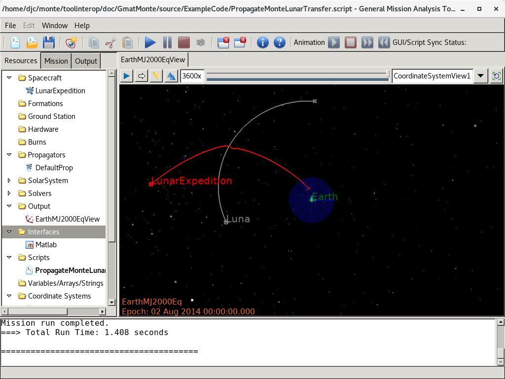

*****************
Ephemeris Sharing
*****************

A Lunar Transfer from Scratch
=============================
As an example of ephemeris sharing between GMAT and Monte, consider the 
following use case:

Monte is used to estimate a spacecraft in a transfer orbit from the Earth to the 
Moon.  The estimated orbit is used to construct an ephemeris file that flies the
spacecraft past the Moon.  GMAT uses the resulting ephemeris to propagate to a 
lunar orbit insertion point, computes an insertion maneuver, applies it, and 
propagates the resulting orbit for a day.  The resulting trajectory is written 
to an ephemeris that Monte can then use as the starting point to estimate the 
trajectory around the Moon.

For the purposes of this example, the starting state for the spacecraft is

.. _EarthToMoonState:
.. table:: Starting State for the Lunar Orbit Insertion Example
   :widths: 30 45

   +-----------------+----------------------------+
   | Field           | Value                      |
   +=================+============================+
   | Epoch           | 23 Jul 2014 20:48:50 UTC   |
   +-----------------+----------------------------+
   | **Cartesian State (Earth MJ2000 Equatorial)**|
   +-----------------+----------------------------+
   | X               |   7482.854 km              |
   +-----------------+----------------------------+
   | Y               |  -4114.938 km              |
   +-----------------+----------------------------+
   | Z               |  -1171.258 km              |
   +-----------------+----------------------------+
   | VX              |   4.436047 km/sec          |
   +-----------------+----------------------------+
   | VY              |   8.268591 km/sec          |
   +-----------------+----------------------------+
   | VZ              |  -1.569608 km/sec          |
   +-----------------+----------------------------+
   | **Keplerian State**                          |
   +-----------------+----------------------------+
   | SMA             | 201811.370 km              |
   +-----------------+----------------------------+
   | ECC             | 0.95729538                 |
   +-----------------+----------------------------+
   | INC             | 12.2665475 deg             |
   +-----------------+----------------------------+
   | RAAN            | 112.0823241 deg            |
   +-----------------+----------------------------+
   | AOP             | 218.3197936 deg            |
   +-----------------+----------------------------+
   | TA              | 1.4399632 deg              |
   +-----------------+----------------------------+

The data in :numref:`EarthToMoonState` provide the estimated state used in this 
example. We will proceed through the following steps:

#. (Monte) Use Monte to generate a ten day ephemeris from the tabulated state.
#. (Monte) Convert the resulting BOA into an SPK kernel that GMAT can read.
#. (GMAT) Read the generated ephemeris into GMAT.
#. (GMAT) Propagate to the Lunar periapsis.
#. (GMAT) Apply a maneuver to insert into lunar orbit.
#. (GMAT) Write an SPK kernel ephemeris that Monte can read that propagates from 
   the starting state, through the maneuver, and for 5 days of Lunar orbit.
#. (Monte) Read the resulting ephemeris and convert it to a Monte BOA.

Steps 1 and 2: Monte Ephemeris Generation
-----------------------------------------

Let's start off with generating an SPK kernel using Monte. Using Monte's mpython
shell, we'll produce a SPICE kernel spanning the ten day period from the
starting state in :numref:`EarthToMoonState`. First, we need to import the
relevant modules:

.. _ImportStatements:
.. code-block:: python
   :caption: Import statements
   :lineno-start: 3

   # Steps 1 and 2 of the Ephemeris Sharing Example 

   # Load a basic set of libraries to use 
   import Monte as M
   import mpy.io.data as defaultData
   import mpy.traj.force.grav.basic as basicGrav
   from mpy.units import *

   from ShowTrajectories import *
   from load_gmat import *

   import cristo

Lines 6-9 import the Monte modules needed to initialize and propagate the
initial trajectory. ShowTrajectorise contains the plotting routines for
comparing the trajectories before and after the GMAT adds the Lunar insertion
maneuver. load_gmat is the Python script configured to load the GMAT API from
a folder outside of the GAMT application folder. Finally, cristo is the Monte
library containing the functions to convert the Monte Boa into a SPICE kernel.

Next, we load the default data from Monte and setup the initial state and forces
used in the Monte propagation:

.. _MonteSetup:
.. code-block:: python
   :caption: Monte setup
   :lineno-start: 20
   
   scName1 = "LunarExpedition"
   scNAIFId1 = -421

   # Load planetary ephemeris de405 from default data
   boa = defaultData.load( "ephem/planet/de405" )

   # Build the gravity nodes connecting the spacecraft to the gravitational
   # bodies we want active.
   # basicGrav.add( boa, scName1, [ "Sun", "Earth", "Moon" ], harmonics = [ "Earth" ] )
   basicGrav.add( boa, scName1, [ "Sun", "Earth", "Moon" ] )

   # Define an initial state of a spacecraft using Cartesian elements
   state = M.State(
      boa, scName1, 'Earth',
      M.Cartesian.x( 7482.854 * km ), 
      M.Cartesian.y( -4114.938 * km ),
      M.Cartesian.z( -1171.258 * km ),
      M.Cartesian.dx( 4.436047 * km/sec ), 
      M.Cartesian.dy( 8.268591 * km/sec ),
      M.Cartesian.dz( -1.569608 * km/sec )
      )

   # Define which forces will act on the spacecraft during propagation.
   forces = [
      M.GravityForce( boa, scName1 ),
      ]

The section of code in :numref:`MonteSetup` loads the planetary ephemeris from
the DE405 file in line 24. Line 29 configures the gravity model for the
spacecraft, using point masses for the Sun, Earth, and Moon. It is possible to
configure a gravity model using spherical harmonics for a planet, as shown in
the prior commented line, but that is not enabled for this example. Lines 32-40
configure the initial state for the spacecraft using Earth centered Cartesian
elements. Lines 43-45 define which forces act on the spacecraft during
propagation.

Next up is the propagation of the spacecraft we just configured using Monte:

.. _MonteProp:
.. code-block:: python
   :caption: Monte propagation
   :lineno-start: 47

   # Set up the beginning and end times for our scenario.
   beginTime = M.Epoch( "23-JUL-2014 20:48:50 UTC" )
   endTime = M.Epoch( "03-AUG-2014 20:48:50 UTC" )

   # Add the initial state to the "IntegState"
   integState = M.IntegState(
      boa,         # Model database used in integration
      beginTime,   # Start time
      endTime,     # End time
      [],          # Events to trigger integration end (none)
      scName1,      # Spacecraft name
      'Earth',     # Center body
      'EME2000',   # Input frame
      'EME2000',   # Integration frame
      state,       # State initial conditions
      forces,      # Forces which act on state
      False,       # Integrate only partial derivatives (false)
      [],          # Parameters to be used in partial derivative calculations (none)
      []           # Partials tolerance scale factors (allows different partial
                   # derivatives to have different integration tolerances, none)
      )

   # Add state to our propagation manager "IntegSetup"
   integ = M.IntegSetup( boa )
   integ.add( integState )

   # Set up the propagator.
   prop = M.DivaPropagator( boa, "DIVA", integ )

   prop.create( boa, beginTime, endTime )

We first define the start and end time of the propagation on lines 48-49.
Lines 52-67 set up the Monte IntegState. The IntegState contains the
information required to propagate the spaceraft. It selects the boa used
(line 53), the start and end times (lines 54-55), and it takes in the name of
the spacecraft which this state applies to (line 57). It also sets the
coordinates used in lines 58-60, including the central body, and the coordinate
frames for the input state and the integration state. The rest of the
construction of the IntegState adds the forces (line 62) and various settings
related to partial derivatives, which are not used in this example. Afterwards,
we create a propagation manager and add the IntegState to it in lines 70-71. The
propagator is created on line 74, in this case a DivaPropagator, and we perform
the propagation on line 76. 

All that's left to do at this point with Monte is to output the trajectory to a
SPICE kernel.

.. _MonteSPKOut:
.. code-block:: python
   :caption: Monte output
   :lineno-start: 78

   # -------------------------------
   # Display the starting trajectory
   # -------------------------------
   theSats = [scName1]
   ShowTrajectory(boa, theSats, beginTime, endTime, False)

   # -------------------------------
   # Write SPK
   # -------------------------------
   SpiceName.bodyInsert( scNAIFId1, scName1 )
   EphemName1 = scName1 + ".bsp"
   cristo.convert( boa, EphemName1 )

Line 82 plots the trajectory that we will write out to the SPK file. Before a
SPICE kernel can be written, a NAIF ID needs to be associated with the
spacecraft, which is done in line 87, and the output can be seen in :numref:`TransferPlot`.
We then use the cristo utility provided by Monte to convert the boa to the SPK on line 89.

.. _TransferPlot:

   The Transfer Trajectory from Monte

In summary so far, we used Python scripting, run using Monte's mpython shell, to
produce a SPICE kernel spanning the ten day period from the starting state in :numref:`EarthToMoonState`.
In the following sections, we will use GMAT to change this trajectory into a 
Lunar capture.

Steps 3 -- 6: GMAT Maneuver Additions
-------------------------------------
Now that Monte has been used to generate a trajectory from the Earth to the 
Moon, GMAT can be used to generate a maneuver that places the spacecraft into
Lunar orbit.  Before automating this process in a Python script for the full 
process (steps 1 -- 6), GMAT is used to build a script that drives the GMAT side 
of things.

Step 3: Viewing the Monte trajectory in GMAT
********************************************
The script in :numref:`GmatPropagationPastLunaDisplay` is a minimal GMAT script 
that reads the Monte generated ephemeris and displays it in a GMAT window.  

.. _GmatPropagationPastLunaDisplay:
.. code-block:: matlab
   :caption: GMAT Reading of the Monte Ephemeris
   :linenos:

   % PropagateMonteLunarTransfer.script

   %---------- Spacecraft
   Create Spacecraft LunarExpedition;
   GMAT LunarExpedition.NAIFId = -421;
   GMAT LunarExpedition.NAIFIdReferenceFrame = -9000001;
   GMAT LunarExpedition.OrbitSpiceKernelName = {'LunarExpedition.bsp'};

   %---------- Propagator
   Create Propagator EarthEphemProp;
   GMAT EarthEphemProp.Type = SPK;
   GMAT EarthEphemProp.StepSize = 300;
   GMAT EarthEphemProp.CentralBody = Earth;
   GMAT EarthEphemProp.EpochFormat = 'UTCGregorian';
   GMAT EarthEphemProp.StartEpoch = '24 Jul 2014 00:00:00.000';

   %---------- Visualization
   Create OpenFramesInterface EarthMJ2000EqView;
   GMAT EarthMJ2000EqView.Add = {LunarExpedition, Earth, Luna};

   %---------- Mission Timeline
   BeginMissionSequence;
   Propagate EarthEphemProp(LunarExpedition) {LunarExpedition.ElapsedDays = 9};

This script shows several features needed to use an ephemeris as the trajectory 
source in GMAT.  

First, a Spacecraft object is created that identifies the ID used in the 
ephemeris file.  For SPICE based epmerides, this setting is assigned by NASA's 
Navigation and Ancillary Information Facility (NAIF). In GMAT, it is stored in 
the spacecraft's NAIFId field.  By convention, spacecraft have negative NAIF 
IDs.  For this example, we use the same ID for the input ephemeris, -421, as we 
assigned in the Monte script in step 2.

GMAT contains a suite of propagators that advance trajectories through time. 
Included in this suite is a propagator that reads SPICE formatted spacecraft
kernel (SPK) ephemeris files like the one generated by Monte.  The EarthEphemProp
propagator scripted in GMAT is an example an ephemeris propagator.  Setting the 
Type field to SPK makes GMAT choose a propagator that reads and processes data 
from a SPICE ephemeris.  The StartEpoch field selects the starting time for the 
propagation.

In this script, that propagation starts July 24, 2014 at midnight and 
propagates the spacecraft for 9 days.  The propagation span is controlled by the
last line of the script:

.. code-block:: matlab

   Propagate EarthEphemProp(LunarExpedition) {LunarExpedition.ElapsedDays = 9};

Note the selection of the ephemeris propagator named EarthEphemProp, applied to
the spacecraft, LunarExpedition, for the desired time span, ElapsedDays = 9.

.. warning::
    Care must be taken when propagating near the beginning or end of the data in
    the ephemeris file. The root finding techniques GMAT uses to locate the
    stopping condition can sometimes cause GMAT to attempt to evaluate
    the state outside the bounds of the ephemeris file, throwing an error and
    stopping script execution.

This script includes one "frill."  For the purposes of illustration, the script
includes a trajectory visualization component that shows the trajectory as
read from the script in a GMAT window.  That visualization is shown in 
:numref:`FlyingPastLuna`.

.. _FlyingPastLuna:

   GMAT Display of the Monte Ephemeris

Steps 4 and 5: Entering Lunar Orbit
***********************************
As can be seen in :numref:`FlyingPastLuna`, the ephemeris generated by Monte 
is perturbed by the Moon, but contiues past the lunar encounter into deep space.
In this example, GMAT is used to execute a maneuver at the lunar encounter that 
places the spacecraft into orbit about the Moon.  The first step in this process 
is to propagate the spacecraft to the Moon and then stop the propagation so that
a maneuver can be performed.  This is done by replacing the nine day propagation
with a new condition to stop propagation when the spacecraft trajectory reaches 
its closest approach to Moon.  This is accomplished by replacing the Propagate 
line in the script with the line

.. _GmatPropagationToPerilune:
.. code-block:: matlab
   :caption: Stopping at Perilune
   :linenos:

   Propagate EarthEphemProp(LunarExpedition) {LunarExpedition.Luna.Periapsis};

Note that, in GMAT, the Moon is referred to with the name "Luna."  When this 
substitution is made in the script, the propagation stops at the Moon.

This change places the spacecraft in the correct position for the lunar orbit 
insertion maneuver.  In order to perform the maneuver, the GMAT script needs 
the following new objects:

*  **LOI**: An impulsive burn object used to model the maneuver
*  **MoonForces**: A force model for the propagation dynamics
*  **MoonProp**: A numerical integrator used to apply the dynamics to the 
   spacecraft to propagate the orbit after the maneuver
*  **DC**: A targeter used to tune the maneuver to make the lunar orbit circular
*  **apRadius**: A variable used to simplify the scripting  

The GMAT scripting for these objects, shown in :numref:`LOIResources`, is 
straightforward:

.. _LOIResources:
.. code-block:: matlab
   :caption: New Objects Used for Lunar Orbit Insertion
   :linenos:

   %---------- ForceModel
   Create ForceModel MoonForces;
   GMAT MoonForces.CentralBody = Luna;
   GMAT MoonForces.PrimaryBodies = {Luna};
   GMAT MoonForces.PointMasses = {Earth, Sun};
   GMAT MoonForces.GravityField.Luna.Degree = 4;
   GMAT MoonForces.GravityField.Luna.Order = 4;
   GMAT MoonForces.GravityField.Luna.PotentialFile = 'LP165P.cof';

   %---------- Propagators
   Create Propagator MoonProp;
   GMAT MoonProp.FM = MoonForces;
   GMAT MoonProp.Type = PrinceDormand78;
   GMAT MoonProp.Accuracy = 1.0e-12;
   GMAT MoonProp.MinStep = 0.0;

   %---------- Burns
   Create ImpulsiveBurn LOI;
   GMAT LOI.CoordinateSystem = Local;
   GMAT LOI.Origin = Luna;
   GMAT LOI.Axes = VNB;

   %---------- Targeter
   Create DifferentialCorrector DC

   %---------- Variables
   Create Variable apRadius

These objects are used in the timeline to apply a tuned maneuver to the 
spacecraft's trajectory, propagating for five days in lunar orbit.  The timeline 
for this sequence is shown in :numref:`LOITargeting`.

.. _LOITargeting:
.. code-block:: matlab
   :caption: The Timeline for Lunar Orbit Insertion
   :linenos:

   BeginMissionSequence;
   Propagate EarthEphemProp(LunarExpedition) {LunarExpedition.Luna.Periapsis};
   apRadius = LunarExpedition.Luna.RadPer + 10.0;

   % Maneuver to a near circular orbit
   Target DC
      Vary DC(LOI.Element1 = -0.5, {Perturbation = 0.0001});
      Maneuver LOI(LunarExpedition);
      Achieve DC(LunarExpedition.Luna.RadApo = apRadius, {Tolerance = 0.10});
   EndTarget

   Propagate MoonProp(LunarExpedition) {LunarExpedition.ElapsedDays = 5};

When these additions are made and the script is run, the spacecraft enters orbit 
at the Moon, as shown in :numref:`LunarOrbit`.

.. _LunarOrbit:

   The Achieved Lunar Orbit

The final step performed in GMAT is the export of this orbit in a form that 
Monte can use.

Step 6: Writing a New Ephemeris from GMAT
*****************************************
In GMAT, output is performed through objects called "subscribers."  One such
subscriber is an ephemeris file object.  GMAT can write ephemerides in a 
variety of formats, including SPICE SPK kernels.  The ephemeris that contains 
the lunar orbit insertion burn scripted above can be written by adding an
ephemeris file object to the script and running it.  The scripting for that 
object is shown in :numref:`LunarExpeditionEphem`.

.. _LunarExpeditionEphem:
.. code-block:: matlab
   :caption: The Ephemeris Object Used to Write the SPK File
   :linenos:

   Create EphemerisFile EphemWithLOI;
   GMAT EphemWithLOI.Spacecraft = LunarExpedition;
   GMAT EphemWithLOI.Filename = 'LunarExpeditionWithLOI.bsp';
   GMAT EphemWithLOI.FileFormat = SPK;
   GMAT EphemWithLOI.EpochFormat = UTCGregorian;
   GMAT EphemWithLOI.InitialEpoch = InitialSpacecraftEpoch;
   GMAT EphemWithLOI.FinalEpoch = FinalSpacecraftEpoch;
   GMAT EphemWithLOI.CoordinateSystem = EarthMJ2000Eq;

When the script is run that includes this object, an ephemeris that Monte can 
read is produced, as expected.  Monte can read that kernel file directly, or
convert it to BOA format.

.. note::
   The steps shown above illustrate ephemeris sharing between Monte and GMAT in a
   relatively labor intensive sequence of steps.  The process can be streamined
   into a sequence of scripted actions using Monte's mpython interpreter and the 
   GMAT Python API.  One approach to scripting this process is shown below.

Steps 3 - 6: Running the GMAT Ephemeris Script Through the API
--------------------------------------------------------------
The Monte and GMAT configurations shown above share settings for the Spacecraft
name, ephemeris names, and naif IDs.  These settings can be consolidated into a 
configuration file.

Continuing the script begun in :numref:`MonteSetup`, we can add API calls to
GMAT in the script to perform the entire Monte-GMAT-Monte operation from one script:

.. _GMATAPIEphem:
.. code-block:: python
   :caption: Running the GMAT Ephemeris Script Through the API
   :lineno-start: 91

   #################################################
   # GMAT Takes Over
   #################################################
   ScriptName = "EnterLunarOrbit.script"
   EphemName2 = "./LunarExpeditionAfterManeuver.bsp"

   import os
   EphemName1Full = os.path.join(os.getcwd(), EphemName1)

   gmat.UseLogFile("./APILogFile.txt")
   gmat.LoadScript(ScriptName)
   sat = gmat.GetObject("LunarExpedition")
   sat.SetField("OrbitSpiceKernelName", EphemName1Full)
   ephem = gmat.GetObject("EphemWithLOI")
   ephem.SetField("Filename", EphemName2)
   gmat.RunScript()

Here, we use the same GMAT script from above (named EnterLunarOrbit.script), but
with a few tweaks. Before we can modify the script, we first need to load the
script through the API, which is done on line 101. The GMAT API provides access
to the resources created in the script via the GetObject() function, which is
called on lines 102 and 104 to access the Spacecraft named "LunarExpedition",
and the EphemerisFile named "EphemWithLOI" we use to write out the new ephemeris
including the maneuver.

We reuse the ephemeris name from Monte's output originally
used in line 89, get its full file path, and store it to the GMAT Spacecraft
object via the "OrbitSpiceKernelName" field in line 103. We also set the output
SPICE ephemeris file name on the EphemerisFile object (line 105) for later reuse
by Monte. The finale GMAT portion of this script is to run the GMAT script (with
the modifications we made in lines 102-104) which is performed by calling
gmat.RunScript() on line 106.

At this point, the new ephemeris has been written to LunarExpeditionAfterManeuver.bsp
and is ready to be read back in by Monte.

Steps 7: Monte import of the GMAT Ephemeris
-------------------------------------------------------------------
Now we can finish this script off by having Monte load the ephemeris generated
by GMAT that now contains the Lunar insertion maneuver:

.. _MonteReadEphem:
.. code-block:: python
   :caption: Reading the GMAT Ephemeris from Monte
   :lineno-start: 108

   #################################################
   # Monte Takes Over
   #################################################
   
   boa.load( EphemName2 )
   
   # -------------------------------
   # Display the final trajectory
   # -------------------------------
   theSats = [scName1]
   # Set up the beginning and end times for our scenario.
   beginTime = M.Epoch( "24-JUL-2014 01:00:00 UTC" )
   endTime = M.Epoch( "02-AUG-2014 12:00:00 UTC" )
   ShowTrajectory(boa, theSats, beginTime, endTime, True)

Loading the SPK kernel with Monte is as simple as calling boa.load() and we
reuse the Python variable we used to set the output file name through the GMAT
API. We can now use the Monte plotting routines to plot the new trajectory as
seen in :numref:`InsertionPlot`.

.. _InsertionPlot:

   The Lunar Insertion Trajectory Generated by GMAT and read with Monte

Appendix: BuildLunarTransferOrbit.mpy
-------------------------------------------------------------------

.. _BuildLunarTransferOrbit:
.. code-block:: python
   :caption: BuildLunarTransferOrbit.mpy 
   :linenos:
   
   # File: BuildLunarTransferOrbit.mpy
   #
   # Steps 1 and 2 of the Ephemeris Sharing Example 

   # Load a basic set of libraries to use 
   import Monte as M
   import mpy.io.data as defaultData
   import mpy.traj.force.grav.basic as basicGrav
   from mpy.units import *

   from ShowTrajectories import *
   from load_gmat import *

   import cristo

   #################################################
   # Monte In Control
   #################################################

   scName1 = "LunarExpedition"
   scNAIFId1 = -421

   # Load planetary ephemeris de405 from default data
   boa = defaultData.load( "ephem/planet/de405" )

   # Build the gravity nodes connecting the spacecraft to the gravitational
   # bodies we want active.
   # basicGrav.add( boa, scName1, [ "Sun", "Earth", "Moon" ], harmonics = [ "Earth" ] )
   basicGrav.add( boa, scName1, [ "Sun", "Earth", "Moon" ] )

   # Define an initial state of a spacecraft using Cartesian elements
   state = M.State(
      boa, scName1, 'Earth',
      M.Cartesian.x( 7482.854 * km ), 
      M.Cartesian.y( -4114.938 * km ),
      M.Cartesian.z( -1171.258 * km ),
      M.Cartesian.dx( 4.436047 * km/sec ), 
      M.Cartesian.dy( 8.268591 * km/sec ),
      M.Cartesian.dz( -1.569608 * km/sec )
      )

   # Define which forces will act on the spacecraft during propagation.
   forces = [
      M.GravityForce( boa, scName1 ),
      ]

   # Set up the beginning and end times for our scenario.
   beginTime = M.Epoch( "23-JUL-2014 20:48:50 UTC" )
   endTime = M.Epoch( "03-AUG-2014 20:48:50 UTC" )

   # Add the initial state to the "IntegState"
   integState = M.IntegState(
      boa,         # Model database used in integration
      beginTime,   # Start time
      endTime,     # End time
      [],          # Events to trigger integration end (none)
      scName1,      # Spacecraft name
      'Earth',     # Center body
      'EME2000',   # Input frame
      'EME2000',   # Integration frame
      state,       # State initial conditions
      forces,      # Forces which act on state
      False,       # Integrate only partial derivatives (false)
      [],          # Parameters to be used in partial derivative calculations (none)
      []           # Partials tolerance scale factors (allows different partial
                   # derivatives to have different integration tolerances, none)
      )

   # Add state to our propagation manager "IntegSetup"
   integ = M.IntegSetup( boa )
   integ.add( integState )

   # Set up the propagator.
   prop = M.DivaPropagator( boa, "DIVA", integ )

   prop.create( boa, beginTime, endTime )

   # -------------------------------
   # Display the starting trajectory
   # -------------------------------
   theSats = [scName1]
   ShowTrajectory(boa, theSats, beginTime, endTime, False)

   # -------------------------------
   # Write SPK
   # -------------------------------
   SpiceName.bodyInsert( scNAIFId1, scName1 )
   EphemName1 = scName1 + ".bsp"
   cristo.convert( boa, EphemName1 )

   #################################################
   # GMAT Takes Over
   #################################################
   ScriptName = "EnterLunarOrbit.script"
   EphemName2 = "./LunarExpeditionAfterManeuver.bsp"

   import os
   EphemName1Full = os.path.join(os.getcwd(), EphemName1)

   gmat.UseLogFile("./APILogFile.txt")
   gmat.LoadScript(ScriptName)
   sat = gmat.GetObject("LunarExpedition")
   sat.SetField("OrbitSpiceKernelName", EphemName1Full)
   ephem = gmat.GetObject("EphemWithLOI")
   ephem.SetField("Filename", EphemName2)
   gmat.RunScript()

   #################################################
   # Monte Takes Over
   #################################################
     
   boa.load( EphemName2 )
    
   # -------------------------------
   # Display the final trajectory
   # -------------------------------
   theSats = [scName1]
   # Set up the beginning and end times for our scenario.
   beginTime = M.Epoch( "24-JUL-2014 01:00:00 UTC" )
   endTime = M.Epoch( "02-AUG-2014 12:00:00 UTC" )
   ShowTrajectory(boa, theSats, beginTime, endTime, True)
