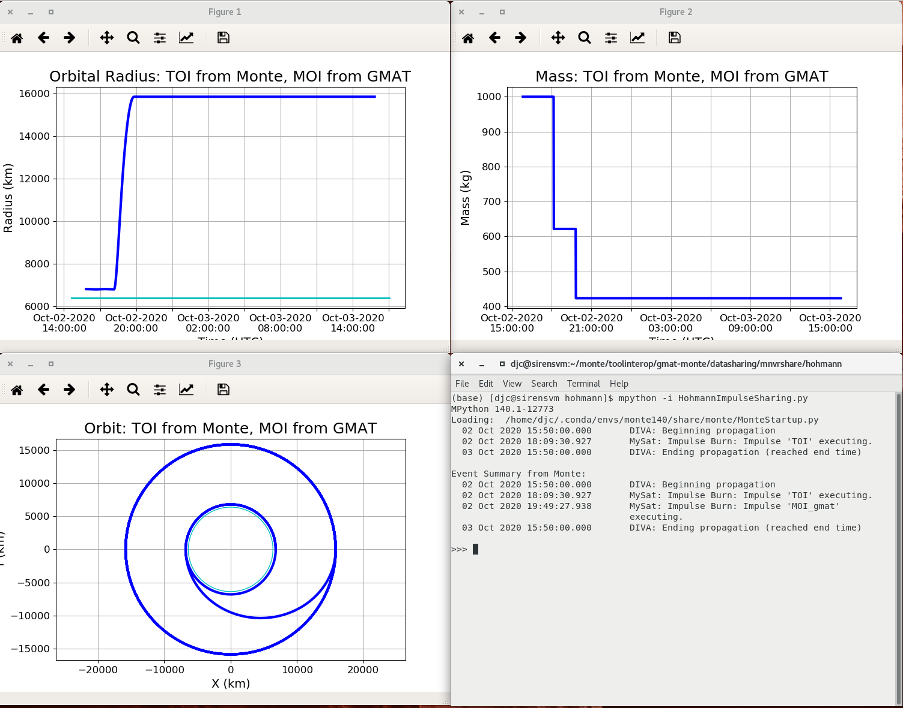

*********************
Maneuver Plan Sharing
*********************
This chapter provides details about one approach to sharing maneuvers between Monte and GMAT.  Depending on your needs, either impulsive or finite burn data can be shared.  In this text, data sharing for both types of maneuvers will be presented.

The Ephemeris sharing chapter worked with ephemerides built, on the GMAT side, from GMAT scripts.  In this chapter, we will perform the GMAT maneuvers through API calls directly, rather than through GMAT scripts.

One core difference between GMAT and Monte is the object model paradigm used in the systems.  GMAT models spacecraft missions through components designed to act like the spacecraft and its component hardware.  For maneuvers, that means that the mass source for mass depletion requires configuration of a fuel tank.  Maneuvers performed during propagation requires the configuration of one or more thrusters.  These elements are all attached to the core Spacecraft object and used in the simulation of the maneuver.  When needed, GMAT can store the state history for a trajectory in an ephemeris object, but that state history is not generally part of the core GMAT object, not is the mass history stored internally in GMAT.

In contrast, Monte acts on a more abstract level.  In Monte, a spacecraft and and its mass properties are modeled in binary object archives (BOAs) tailored to each of the elements that is modeled - the state, the mass, and so forth.  These BOAs are identified with one another through the name associated with the data set.  Basically, to model a spacecraft that needs to maneuver and deplete mass, Monte uses a BOA containing the spacecraft's initial state information.  An integrated state object is added to that BOA for propagation.  This integrated state object stores the state history when the propagation is applied.  The integration state object also tracks the vehicle mass when a mass, associated with the spacecraft (by name), is added to the propagation state container.

Both of the above paragraphs may be confusing.  The rest of this chapter walks through the configuration for impulsive and finite burns in both systems, and shows how to exchange the associated maneuver data between GMAT and Monte. 

Basic Configuration
===================
GMAT and Monte have different core objects that need to be built in order to perform maneuvers. The necessary components, by system, are tabulated in :numref:`CoreMnvrComponents`.  The objects listed in that table are common to both impulsive and finite burns.  Additional pieces are needed based on the type of maneuver to be performed.

.. _CoreMnvrComponents:
.. table:: Components needed in GMAT and Monte for Maneuvering
   :widths: 30 25 45

   +----------------------------+----------------------------------------+----------------------------------------+
   | Role                       | Monte Object                           | GMAT Object                            |
   +============================+========================================+========================================+
   | Initial state              | State, set in a BOA                    | Spacecraft state at start of run       |
   +----------------------------+----------------------------------------+----------------------------------------+
   | State that is maneuvered   | State, integrated to epoch using an    | Integrated Spacecraft state at         |
   |                            | IntegSetup                             | maneuver epoch                         |
   +----------------------------+----------------------------------------+----------------------------------------+
   | Fuel/Mass Source           | IntegSetup member                      | A ChemicalTank or ElectricTank         |
   +----------------------------+----------------------------------------+----------------------------------------+
   | The Space Environment      | Boa members                            | SolarSystem                            |
   +----------------------------+----------------------------------------+----------------------------------------+

The following paragraphs describe configuration of the minimal core components needed in Monte and GMAT, outside of the maneuvers themselves, for an impulsive burn that can be shared between the systems.  In both the GMAT and Monte configuration descriptions, the configuration is built using Monte's mpython application wrapper.  Mpython loads the conda environment configured for Monte during installation, and then launches the Python interpreter included in the Monte release.

Monte Configuration
-------------------
The Monte configuration requires the use of several core Monte packages: Monte itself, a data package that contains the environmental data sets - things like planetary ephemerides and core coordinate systems, and the Monte unit definitions used during configuration.  To simplify the integration pieces discussed later, we'll also load the Monte gravitational force dynamics.  This preliminary setup is shown in :numref:`MonteSetupMnvr`.

.. _MonteSetupMnvr:
.. code-block:: python
   :caption: Monte Import Modules used for Maneuver Sharing Sample Code

	#=======================================================================
	# Load Monte modules
	#=======================================================================

	# Load a basic set of libraries to use 
	import Monte as M
	import mpy.io.data as defaultData
	import mpy.traj.force.grav.basic as basicGrav
	from mpy.units import *

These package settings build the core Monte infrastructure used in the remainder of the Monte code in this chapter.  From these settings

The BOA 
+++++++
The binary object archive (BOA) used for the Monte side of the shared maneuver plan defines the core objects used in the Monte simulation.  The maneuver sharing presented here needs a basic BOA containing the solar system bodies long with the objects we add to it.  :numref:`BoaSetup` provides this basic configuration, and sets the name for the spacecraft used in this text for illustrative purposes.

.. _BoaSetup:
.. code-block:: python
   :caption: Configuration for a Basic Maneuver Sharing BOA 

	#=======================================================================
	# Using the default BOA, set up the solar system
	#=======================================================================
	boa = defaultData.load( "ephem/planet/de405" )

	# The spacecraft is named MySat, so use this name during the configuration
	satName = "MySat"

This basic configuration provides the framework that is used for the starting configuration of the system, captured in the spacecraft orbital state information described next. 

Spacecraft Details
++++++++++++++++++
Maneuvers in both Monte and GMAT are applied to an orbital state at a specific time.  The Monte state manipulated by the maneuver is collected from a Monte State object, propagated to the epoch of the maneuver.  That state matches the configuration of the spacecraft elements used in GMAT at the start of propagation an impulsive maneuver.  The epoch and state definition in Monte is shown in :numref:`MonteInitialState`, along with the starting mass information for the simulation.

.. _MonteInitialState:
.. code-block:: python
   :caption: Definition of the Starting State for the Simulation

	#=======================================================================
	# Start from a LEO orbit for MySat, initialized at the epoch of the day
	# and time this file was created.
	#=======================================================================
	# Set the start epoch to the date this script was first edited
	t0 = Epoch('10/2/2020 15:50:00 UTC')

	# Define a LEO orbit, near equatorial, with the state set at perigee
	state0 = State( boa, satName, "Earth",
	                Conic.semiMajorAxis(6800*km),
	                Conic.eccentricity(0.0011),
	                Conic.inclination(3.2*deg),
	                Conic.longitudeOfNode(90*deg),
	                Conic.argumentOfPeriapsis(90*deg),
	                Conic.trueAnomaly(180*deg),
	                )

	# Use a total starting mass of 1000 kg.  In GMAT, this will be 800 kg dry mass
	# and 200 kg fuel mass at the start of the mission timeline
	mass0 = 1000*kg

The maneuver typically needs to be applied at a different epoch from the one selected for the starting state.  That means that the Monte integration system needs to be informed about the state that needs to propagate.  :numref:`MonteIntegrationState` sets these data for the Monte integrator.

.. _MonteIntegrationState:
.. code-block:: python
   :caption: Configuration of the State Used by the Monte Integrator

	# Set up the state that propagates through time and that received the maneuver
	integState = IntegSetup(boa)
	integState.addState( t0, satName, "Earth", "EME2000", state0 )
	integState.addMass( t0, satName, mass0 )
	integState.setStateTol( 1e-10 )

The Monte Integrator
++++++++++++++++++++
The final piece necessary for a Monte maneuver plan is a configured propagation setup.  In Monte, numerical integration is performed using the DIVA propagator.  The propagator uses a set of forces assigned to the state that is propagated that have been configured to match the problem being modeled.  :numref:`MontePropagationSetup` shows the steps needed to construct a basic Sun-Earth-Moon gravity model associated with a spacecraft state in the BOA, and then to add a DIVA integrator to the BOA.

.. _MontePropagationSetup:
.. code-block:: python
   :caption: Configuration of Monte's Diva Propagator

	#=======================================================================
	# Build the DivaTraj integrator
	#=======================================================================

	grav = Gravity( boa, satName )
	grav.insert( GravityNode( "", "", "Sun", 0*km ) )

	#  Create an Earth system node as a child of the solar system barycenter
	grav.insert( GravityNode( "", "", "Earth", 2.5e6*km ) )
	#  Add the Moon as a child node of the Earth system node
	grav.insert( GravityNode( "Earth", "", "Moon", 0*km ) )

	#  Create the propagator
	divaProp = DivaPropagator( boa, "DIVA", integState )

	#  Configure the step size tolerances. 
	divaProp.setMinStep( 1*sec )
	divaProp.setMaxStep( 8*86400*sec )

This completes the configuration in Monte that sets up the system for Maneuver sharing.  GMAT has a similar configuration process, shown next.

GMAT Configuration
------------------
The GMAT configuration sets up the objects needed for GMAT to model the shared simulation.  The objects necessary are similar to those needed on Monte at a generic level, but with significant differences because of the different organizational principles between the systems.  In GMAT, Maneuvers require a Spacecraft object and, for mass depletion, an attached fuel tank.  The space environment -- things like planetary ephemerides and associated properties -- is configured as part of the GMAT system in general, and then manipulated to meet the needs of the simulation.

The Monte configuration started by loading the needed Monte modules into the run-time environment.  The GMAT corresponding loading step shown in :numref:`GmatSetupForMnvr`.

.. _GmatSetupForMnvr:
.. code-block:: python
   :caption: GMAT Import Modules used for Maneuver Sharing Sample Code

	#=======================================================================
	# Load GMAT modules
	#=======================================================================

	# Load the GMAT libraries for use 
	from load_gmat import *

This package import loads build the core GMAT system into the simulation.  Access to GMAT's components are made using the package prefix "gmat." 

Spacecraft Details
++++++++++++++++++
Maneuvers in both GMAT and Monte are applied to an orbital state at a specific time.  The GMAT state manipulated by the maneuver is the state of a Spacecraft object configured in the system.  In GMAT, the Spacecraft collect together the full set of modeled properties for the vehicle.  The core object tracks the position and velocity at an instant of time, along with the ballistic settings, spatial orientation, and, when needed, ephemeris sources.  The spacecraft object uses attached hardware objects to model thrusters and tanks attached to the vehicle, and antennae and communications components for modeling tracking data and spacecraft sensors.  Mass depleted during a maneuver is drawn from a fuel tank component.  The total spacecraft mass is computed by adding the fuel mass from all attached tanks to the spacecraft's dry mass.

A representative spacecraft configuration matching the spacecraft state data set for Monte, above, is shown in :numref:`GmatInitialState`.  The spacecraft configured here os an 800 kg vehicle with 200 kg of available fuel mass.

.. _GmatInitialState:
.. code-block:: python
   :caption: Definition of the Starting State for the Simulation

	# Set up a GMAT spacecraft for the GMAT side of the simulation
	mysat = gmat.Construct("Spacecraft","MySat")
	mysat.SetField("DateFormat","UTCGregorian")
	mysat.SetField("DisplayStateType","Keplerian")

	#=======================================================================
	# Start from a LEO orbit for MySat
	#=======================================================================
	mysat.SetField("Epoch","02 Oct 2020 15:50:00.000")
	mysat.SetField("SMA",6800)
	mysat.SetField("ECC",0.0011)
	mysat.SetField("INC",3.2)
	mysat.SetField("RAAN",90)
	mysat.SetField("AOP",90)
	mysat.SetField("TA",180)

	# Add in mass data: 800 kg dry mass and 200 kg fuel, in a tank
	mysat.SetField("DryMass",800)

	tank = gmat.Construct("ChemicalTank","FuelTank")
	tank.SetField("FuelMass", 200)
	mysat.SetField("Tanks","FuelTank")

The GMAT Integrator
+++++++++++++++++++
As was the case in Monte, we need propagation system in the GMAT configuration.  The Monte configuration added forces with gravity modeled for the Sun, Earth, and Moon to the BOA, all associated with the state that represents the spacecraft.  In GMAT, the forces are collected into a force model (really, and instance of the GMAT ODEModel class) and that object, along with a numerical integrator, are set in a Propagator object.  The code in :numref:`GmatIntegrator` shows how these components are configured for GMAT.

.. _GmatIntegrator:
.. code-block:: python
   :caption: Configuration of GMAT Propagator

	#=======================================================================
	# Build the GMAT force model and integrator
	#=======================================================================
	fm = gmat.Construct("ForceModel","FM")
	epm  = gmat.Construct("PointMassForce")
	epm.SetField("BodyName","Earth")
	spm  = gmat.Construct("PointMassForce")
	spm.SetField("BodyName","Sun")
	mpm  = gmat.Construct("PointMassForce")
	mpm.SetField("BodyName","Luna")

	fm.AddForce(epm)
	fm.AddForce(spm)
	fm.AddForce(mpm)

	prop = gmat.Construct("Propagator","Prop")
	prop.SetField("FM","FM")
	prop.SetField("Type","PrinceDormand78")

	gmat.Initialize()

This aspect of the configuration settings illustrated one of the differences between GMAT and Monte.  In GMAT, the propagation system is set separately from the spacecraft configuration.  This lets GMAT propagate multiple spacecraft simultaneously.  In Monte, the setting is more closely tied to the state that is propagated through the force settings associated with the named integration state settings.  Each approach has advantages and disadvantages.  Knowing about the difference helps to understand the underlying code.

The code for the completed configurations shown above is the core code used to illustrate shared maneuver plans between GMAT and Monte.  This configuration is stored in a Python script named ManeuverPlanSharing_Setup.py.  That script is loaded as part of the maneuver sharing descriptions for impulsive and finite burns below.

Impulsive Burns
===============
:numref:`ImpulsiveMnvrComponents` tabulates the objects required in Monte and GMAT for impulsive burn modeling.  In Monte, an impulse is applied as an element of the Monte dynamics model represented by an ImpulseBurnForce entry in the model, and by an ImpulseBurn object configured for the burn.  In GMAT, the maneuver is modeled as an ImpulsiveBurn object that is applied to the spacecraft during a pause in the spacecraft propagation.  

.. _ImpulsiveMnvrComponents:
.. table:: Components needed in GMAT and Monte for Impulsive Burns
   :widths: 30 25 45

   +----------------------------+----------------------------------------+----------------------------------------+
   | Role                       | Monte Object                           | GMAT Object                            |
   +============================+========================================+========================================+
   | The burn                   | ImpulseBurn                            | ImpulsiveBurn                          |
   +----------------------------+----------------------------------------+----------------------------------------+
   | Application Component      | ImpulseBurnMgr                         | Maneuver                               |
   +----------------------------+----------------------------------------+----------------------------------------+
   |                            | ImpulseBurnForce                       |                                        |
   +----------------------------+----------------------------------------+----------------------------------------+

In GMAT's scripting language, the maneuver is applied using a Maneuver command in the mission timeline.  The API version of this piece - applying the burn directly rather than from a GMAT script - will be used in the text below.  

In Monte, an impulsive burn manager (ImpulseBurnMgr) object is configured to collect ImpulseBurn objects together for the dynamics model.  The dynamics model is configured to use this manager through an entry in its configuration.  The Monte text, below, walks you through those steps.

GMAT Configuration
------------------
Construction of a GMAT Impulsive burn follows the same pattern as other GMAT objects.  First, we construct a named object for configuration, and then set the fields defining the properties of the object.  :numref:`GmatImpulsiveBurn` shows these settings for a 1 km/s impulse, :math:`\Delta V` applied in a spacecraft's velocity direction relative to the Earth.  The impulse is set to deplete mass from a fuel tank named "FuelTank" using the Tsiolkovsky rocket equation: 

.. math::

	\Delta m = {m_0 (1 - e^{-{{\Delta V}\over{{I_{sp} g}}}})}

The impulse uses a specific impulse, :math:`I_{sp}`, of 300 seconds and GMAT's default acceleration due to gravity, :math:`g = 9.81 {{m}\over{s^2}}`, to compute the mass expended during the maneuver.  

.. _GmatImpulsiveBurn:
.. code-block:: python
   :caption: Configuration of an impulsive burn in GMAT
   :lineno-start: 1

	# Setup a GMAT Impulsive burn
	toi = gmat.Construct("ImpulsiveBurn","TOI")

	# Set the burn to deplete mass from the tank
	toi.SetField("DecrementMass",True)
	toi.SetField("Tank","FuelTank")
	toi.SetField("Isp",300.0)

	# Set the coordinate system used for the burn
	# These are the default settings
	toi.SetField("CoordinateSystem", "Local");
	toi.SetField("Origin", "Earth")
	toi.SetField("Axes", "VNB";

	# Enter the impulse as a vector, in km/s
	toi.SetField("Element1", 1.0)
	toi.SetField("Element2", 0.0)	# Default setting
	toi.SetField("Element3", 0.0)	# Default setting

GMAT can specify the maneuver in any of GMAT's coordinate systems, or one of four "local" systems as described in the GMAT User's Guide.  The VNB frame used here is defined in GMAT to simplify use of a very common maneuver definition without the need for an explicit coordinate system.  GMAT's local VNB axis system sets the maneuver X-direction along the spacecraft's velocity vector and the Y-axis along the orbit normal, as measured relative to a specified origin.  (As noted in the Python comments, this is the default GMAT impulsive burn reference frame, so lines 9-13 in the listing are not needed here, but are provided for completeness.)

The actual Delta-V to be applied in GMAT is specified by setting the three maneuver components individually.  Lines 16-18 of the listing show an example of this configuration.  The maneuver defined in those lines is a 1 km/s impulse in the velocity direction.  

This completes configuration for an impulsive maneuver in GMAT.  Folks familiar with Monte may be wondering, at this point, about the epoch for the maneuver.  In GMAT, the maneuver is fired as part of the mission control sequence (in GMAT scripts) between propagation spans.  The example below will show how this maneuvering works from the GMAT API.

Monte Configuration
-------------------
In Monte, the coordinate frame is defined first and used to set the impulse to apply to a state history at a specific epoch.  Like GMAT, Monte has a coordinate frame that is based on the velocity of a body.  That Monte frame sets the Y-axis to point in the velocity direction, and the Z-axis to point along the orbit normal, as specified in a Monte coordinate frame.  :numref:`MonteImpulsiveBurn` uses the BodyVelDirFrame constructor (lines 2-3) to build this frame for the state associated with satName, and places that frame in the BOA file for later use.  The Monte frame built here is based on rotations from the Earth Mean-of-J2000 Equatorial system, EME2000, defined over the default Monte time interval, and uses the Earth as the central body of reference for the velocity calculations. 

.. _MonteImpulsiveBurn:
.. code-block:: python
   :caption: Configuration of an impulsive burn in Monte
   :lineno-start: 1

	# Define the VNB frame - for Monte, this is a BVN frame
	BodyVelDirFrame( boa, "BVN Frame", "EME2000", TimeInterval(),
	                 satName, "Earth" )

	toiDV = Unit3Vec( ( 0*m/s, 1000*m/s, 0*m/s ) )
	epoch = "14 Oct 2020 16:45:00.00 UTC"
	toiburn = ImpulseBurn( "TOI", epoch, "BVN Frame", toiDV, 300*sec )

	# Manage the impulsive Burn 
	ibm = ImpulseBurnMgr( boa, satName )
	ibm.insert( toiburn )

	# Include it in the dynamics model
	divaProp.addForce( ImpulseBurnForce( boa, satName ) )

The Delta-V impulse to be applied is defined in Monte as a three vector that includes units, created using the Unit3Vec constructor shown on line 5.  Since the Monte reference frame defines the Y-direction as the velocity direction, the GMAT impulse configured in the GMAT Configuration text above is defined in Monte by setting the Y component in the constructor call to 1 km/s (1000 m/s in the listing), while zeroing the other components. 

Impulsive maneuvers in Monte are set at specific epochs or event locations.  This example uses an epoch for the maneuver setting, defined on line 6.  

These constituent elements of the maneuver are used to build the impulsive burn object on line 7.  That constructor call identifies the burn by giving it a name, specifies when the burn should be applied, and sets the frame and components of the burn.  It also specifies the specific impulse that is used for mass depletion.  

Note the difference between GMAT and Monte here.  In Monte, you define the pieces needed for the impulsive burn and then put them together when you build the burn object.  In GMAT, you build the impulsive burn object, and then set it up by setting fields on that object.

The burn object defined here for Monte is not yet part of a BOA.  Maneuvers in Monte are added to a BOA using a container that associates burns with maneuvering bodies.  For impulsive burns, this container is an ImpulseBurnMgr, constructed on line 10.  The constructor associates the container with the satName object, and places it in the BOA used for this example.  Once this container has been created, the configured burn is added to it, as shown on line 11.  Finally, the Monte propagation system is told to expect impulsive burns by adding impulsive burn modeling to the propagator, as shown on line 14.

Helper Functions Between Monte and GMAT
---------------------------------------
:numref:`SharingImpulsiveData` shows the settings for GMAT and Monte for an impulsive burn, side by side.  While the differences between the systems is apparent in the table, the similarities are also apparent.  For example, given the Delta-V for a GMAT impulsive maneuver, that maneuver can be passed to Monte in the Unit3Vec constructor by reading the GMAT components from GMAT's ImpulsiveBurn object and assigning those components units of km/s.  The other settings can be passed similarly.  One wrinkle is the absence of an epoch on the GMAT side.  That setting can be collected as GMAT runs, as will be shown shortly.

.. _SharingImpulsiveData:
.. table:: Impulsive Burn Settings in GMAT and Monte
   :widths: 15 35 15 35

   +------------------+----------------------------------------+------------------+----------------------------------------+
   | GMAT                                                      | Monte                                                     |
   +------------------+----------------------------------------+------------------+----------------------------------------+
   | Object           | Setting                                | Object           | Setting                                |
   +==================+========================================+==================+========================================+
   | toi              | CoordinateSystem = Local               | BVN Frame        | In Constructor                         |
   +------------------+----------------------------------------+------------------+----------------------------------------+
   |                  | Origin = Earth                         |                  | In Constructor                         |
   +------------------+----------------------------------------+------------------+----------------------------------------+
   |                  | Axes = VNB                             |                  | Implied by Type                        |
   +------------------+----------------------------------------+------------------+----------------------------------------+
   |                  | Element1 = 1.0                         | toiDV            | Unit3Vec Constructor                   |
   +------------------+----------------------------------------+------------------+----------------------------------------+
   |                  | Element2 = 0.0                         |                  |                                        |
   +------------------+----------------------------------------+------------------+----------------------------------------+
   |                  | Element3 = 0.0                         |                  |                                        |
   +------------------+----------------------------------------+------------------+----------------------------------------+
   |                  | DecrementMass = True                   |                  | Implied by Settings                    |
   +------------------+----------------------------------------+------------------+----------------------------------------+
   |                  | Isp = 300.0                            |                  | In Constructor                         |
   +------------------+----------------------------------------+------------------+----------------------------------------+
   |                  | Tank = FuelTank                        | N/A              |                                        |
   +------------------+----------------------------------------+------------------+----------------------------------------+
   | N/A              |                                        | epoch            | In Constructor                         |
   +------------------+----------------------------------------+------------------+----------------------------------------+
   | N/A              |                                        | toiburn          |                                        |
   +------------------+----------------------------------------+------------------+----------------------------------------+
   | N/A              |                                        | ibm              |                                        |
   +------------------+----------------------------------------+------------------+----------------------------------------+

Impulsive burn translation between GMAT and Monte is a straightforward task using the tabulated settings.  A new Python file, GmatMonte.py, has been created to make this process consistent and reproducible.  The GmatMonte file defines a set of Python functions that build maneuvers for one system based on inputs from the other. The functions are named with a preface indicating the direction of the translates: functions prefaces with G2M\_ take GMAT inputs and build Monte objects, and those prefaced M2G\_ take Monte inputs and create GMAT objects.  :numref:`MonteGMATFun` lists the functions built from the descriptions above, used to translate velocity based impulses between the two systems.

.. _MonteGMATFun:
.. table:: Impulsive Burn Functions Connecting GMAT and Monte
   :widths: 20 25 60

   +------------------+-------------------------------+---------------------------------------------------------------------+
   | Function         | Purpose                                                                                             |
   +==================+===============================+=====================================================================+
   | G2M_VnbBurn      | Impulsive burn function used to convert a GMAT impulsive VNB burn into a Monte impulsive burn       |
   +                  +-------------------------------+---------------------------------------------------------------------+
   |                  | *Argument/Return*             | *Description*                                                       |
   +                  +-------------------------------+---------------------------------------------------------------------+
   |                  | gmatBurn                      | The GMAT burn that is translated into a Monte burn                  |
   +                  +-------------------------------+---------------------------------------------------------------------+
   |                  | utcEpoch                      | The UTC Gregorian epoch for the burn                                |
   +                  +-------------------------------+---------------------------------------------------------------------+
   |                  | theBoa                        | The Monte BOA that receives the frame used for the new burn         |
   +                  +-------------------------------+---------------------------------------------------------------------+
   |                  | satName                       | The Monte label for the body that is maneuvered                     |
   +                  +-------------------------------+---------------------------------------------------------------------+
   |                  | **returns**                   | A Monte ImpulseBurn that matches the GMAT data                      |
   +------------------+-------------------------------+---------------------------------------------------------------------+
   | M2G_BvnBurn      | Impulsive burn function used to convert a Monte impulsive BVN burn into a GMAT impulsive burn       |
   +                  +-------------------------------+---------------------------------------------------------------------+
   |                  | *Argument/Return*             | *Description*                                                       |
   +                  +-------------------------------+---------------------------------------------------------------------+
   |                  | monteBurn                     | The Monte burn that is translated into a GMAT burn                  |
   +                  +-------------------------------+---------------------------------------------------------------------+
   |                  | theBoa                        | The Monte BOA that contains the frame used for the Monte burn       |
   +                  +-------------------------------+---------------------------------------------------------------------+
   |                  | gmatTank                      | The name of the GMAT tank used for mass depletion.  An empty string |
   |                  |                               | indicates no mass flow for the burn.                                |
   +                  +-------------------------------+---------------------------------------------------------------------+
   |                  | **returns**                   | A GMAT ImpuliveBurn that matches the Monte data                     |
   +------------------+-------------------------------+---------------------------------------------------------------------+
   | M2G_BurnEpoch    | Function used to retrieve the time of a burn from a Monte ImpulseBurn                               |
   +                  +-------------------------------+---------------------------------------------------------------------+
   |                  | *Argument/Return*             | *Description*                                                       |
   +                  +-------------------------------+---------------------------------------------------------------------+
   |                  | monteBurn                     | The Monte burn containing epoch data                                |
   +                  +-------------------------------+---------------------------------------------------------------------+
   |                  | **returns**                   | The epoch of the burn, in GMAT's UTC Gregorian format               |
   +------------------+-------------------------------+---------------------------------------------------------------------+
   |M2G_CopySpacecraft| Function used to set a Monte state on a GMAT spacecraft                                             |
   +                  +-------------------------------+---------------------------------------------------------------------+
   |                  | *Argument/Return*             | *Description*                                                       |
   +                  +-------------------------------+---------------------------------------------------------------------+
   |                  | monteState                    | The Monte state used to set the GMAT Spacecraft state               |
   +                  +-------------------------------+---------------------------------------------------------------------+
   |                  | monteEpoch                    | The Monte epoch for the Spacecraft state                            |
   +                  +-------------------------------+---------------------------------------------------------------------+
   |                  | gmatSpacecraft                | The Monte burn containing epoch data                                |
   +                  +-------------------------------+---------------------------------------------------------------------+
   |                  | **returns**                   | No return; the spacecraft state is updated                          |
   +------------------+-------------------------------+---------------------------------------------------------------------+

We can use these functions and the earlier configuration information to demonstrate impulsive maneuver sharing between Monte and GMAT.

Maneuver Sharing Example: A Hohmann Transfer
--------------------------------------------
As an example of maneuver sharing, this section demonstrates the generation of a Hohmann transfer using maneuvers computed in each system.  The first maneuver will be generated by Monte, and the second by GMAT, with the transfer then displayed in Monte plots.  

Configuration
+++++++++++++
:numref:`MonteHohmannConfiguration` shows the Monte configuration used for this example problem.  The spacecraft starts in a near circular low Earth orbit, with a starting mass of 1000 kg.  The propagator is set to use gravity models for the Sun, Earth and Moon, and to propagate with a maximum one hour step size.

.. _MonteHohmannConfiguration:
.. code-block:: python
   :caption: Monte Configuration for the Hohmann Transfer Maneuver Sharing Example
   :lineno-start: 1

	# Load a basic set of Monte modules to use 
	import Monte as M
	import mpy.io.data as defaultData
	import mpy.traj.force.grav.basic as basicGrav
	from mpy.units import *

	# Using the default BOA, set up the solar system
	boa = defaultData.load( "ephem/planet/de405" )

	# The spacecraft is named MySat, so use this name during the configuration
	satName = "MySat"

	# Set the start epoch to the date this script was first edited
	t0 = Epoch('10/2/2020 15:50:00 UTC')
	# Define a LEO orbit, near equatorial, with the state set at apogee
	state0 = State( boa, satName, "Earth",
	                Conic.semiMajorAxis(6800*km),
	                Conic.eccentricity(0.0011),
	                Conic.inclination(3.2*deg),
	                Conic.longitudeOfNode(90*deg),
	                Conic.argumentOfPeriapsis(90*deg),
	                Conic.trueAnomaly(180*deg),
	                )

	# Use a total mass of 1000 kg
	mass0 = 1000*kg

	# Set up the state that propagates through time and that received the maneuver
	integState = IntegSetup(boa)
	integState.addState( t0, satName, "Earth", "EME2000", state0 )
	integState.addMass( t0, satName, mass0 )
	integState.setStateTol( 1e-10 )

	# Build the propagator using gravity from the Sun, Earth and Moon
	grav = Gravity( boa, satName )

	grav.insert( GravityNode( "", "", "Sun", 0*km ) )
	grav.insert( GravityNode( "", "", "Earth", 2.5e6*km ) )
	grav.insert( GravityNode( "Earth", "", "Moon", 0*km ) )

	#  Create the propagator for the spacecraft
	divaProp = DivaPropagator( boa, "DIVA", integState )

	#  Configure the step size tolerances. 
	divaProp.setMinStep( 1 * sec )
	divaProp.setMaxStep( 3600 * sec )

	# Setup the impulsive burn manager, but don't add burns yet
	ibm = ImpulseBurnMgr( boa, satName )

	# Add forces to the propagator
	forces = [ GravityForce, ImpulseBurnForce, ]
	for forceClass in forces:
	   divaProp.addForce( forceClass( boa, satName ) )

For this example, the GMAT spacecraft configuration is built based on the Monte configuration.  The force model is configured separately, and the mass properties are set to use a spacecraft fuel tank.  :numref:`GmatHohmannConfiguration` shows the GMAT setup.  Note the call to the M2G_CopySpacecraft() function on line 10.  This function ensures that Monte and GMAT both work from the same initial state.   

.. _GmatHohmannConfiguration:
.. code-block:: python
   :caption: GMAT Configuration for the Hohmann Transfer Maneuver Sharing Example
   :lineno-start: 1

	# Load the GMAT Modules
	from load_gmat import *
	import GmatFunctions as GF

	# GMAT-Monte Interface Functions
	import GmatMonte as GM

	# Spacecraft Configuration
	mysat = gmat.Construct("Spacecraft","MySat")
    GM.M2G_CopySpacecraft(state0, t0, mysat)

	# Add in mass data: 800 kg fuel mass in a tank and 200 kg dry mass
	mysat.SetField("DryMass", 200)

	tank = gmat.Construct("ChemicalTank","Tank")
	tank.SetField("FuelMass", 800)
	mysat.SetField("Tanks","Tank")

	#=======================================================================
	# Build the GMAT force model and integrator
	#=======================================================================
	fm = gmat.Construct("ForceModel","FM")
	epm  = gmat.Construct("PointMassForce")
	epm.SetField("BodyName","Earth")
	spm  = gmat.Construct("PointMassForce")
	spm.SetField("BodyName","Sun")
	mpm  = gmat.Construct("PointMassForce")
	mpm.SetField("BodyName","Luna")

	fm.AddForce(epm)
	fm.AddForce(spm)
	fm.AddForce(mpm)

	pdProp = gmat.Construct("Propagator","Prop")
	pdProp.SetField("FM","FM")
	pdProp.SetField("Type","PrinceDormand78")

	gmat.Initialize()

This completes the configuration settings for this example.  The configuration is coded in the HohmannImpulseSharing.py script.

Transfer Orbit Insertion Burn (Monte)
+++++++++++++++++++++++++++++++++++++
THe first maneuver for this example is performed in Monte.  Scripting for teh maneuver is shown in :numref:`MonteHohmannImplementation`.

.. _MonteHohmannImplementation:
.. code-block:: python
   :caption: Hohmann Transfer TOI Planning in Monte
   :lineno-start: 1

	# Use Monte to find the second perigee
	p1 = ApsisEvent( TrajQuery(boa,satName,"Earth","EME2000"), ApsisEvent.PERIAPSIS )
	p = CountEvent( EpochEvent(t0), p1, 2 )

	# Define the VNB frame - for Monte, this is a BVN frame
	BodyVelDirFrame( boa, "BVN Frame", "EME2000", TimeInterval(),
	                 satName, "Earth" )

	# Set the transfer orbit delta-V
	dv1 = 1400

	# Build and model the TOI burn in Monte
	toiDV = Unit3Vec( ( 0 * m/s, dv1 * m/s, 0 * m/s ) )
	toiburn_m = ImpulseBurn( "TOI", p, "BVN Frame", toiDV, 300 * sec )

	# Insert the TOI burn into the impulsive burn manager
	ibm.clear()
	ibm.insert( toiburn_m )

	# Prop for one day
	tf = t0 + 1*day

	divaProp.setupModels()
	divaProp.writeOutput( t0, tf, boa )

The listing shows the code used to tell the Diva propagator to locate the second perigee point (lines 1-3), the point for the transfer orbit insertion (TOI) maneuver.  Lines 5-7 set up the Monte BVN reference frame used for the 1400 m/s maneuver delta-V (lines 9-10).  That impulse is applied in the velocity directed component of the burn's 3-vector in lines 12 and 13.  All of these settings are used in the burn constructor on line 14.

In Monte, maneuvers are placed in a burn manager that the propagator accesses as part of its modeling.  The impulsive burn manager, ibm, for the Monte BOA was set up in the configuration scripting shown above.  Lines 16-18 use this manager to incorporate the Monte impulsive burn into the Monte simulation.  

Finally, the Diva propagator is generate a simulation for a one day span (line 21), initialize its modeling, and then integrate the system, storing the results in the BOA.

Mission Orbit Insertion Burn (GMAT)
+++++++++++++++++++++++++++++++++++
:numref:`GMATHohmannImplementation` picks up where the TOI design left off.  The scripting imports the Monte configuration data into GMAT, uses GMAT to model the system from start through TOI, and then to apogee, at which point the MOI burn is constructed in GMAT.

.. _GMATHohmannImplementation:
.. code-block:: python
   :caption: Hohmann Transfer MOI Planning in GMAT
   :lineno-start: 1

	### Import Monte burn into GMAT

	# Build the GMAT TOI burn using the Monte burn
	toiBurn_g = GM.M2G_BvnBurn(toiburn_m, boa, "FuelTank")
	toiBurn_g.SetReference(mysat)

	# Find the time needed to propagate to TOI
	toiEpoch = GM.M2G_BurnEpoch(boa, "TOI")
	dt = GF.FindTimeDifference(startEpoch, toiEpoch)

	# Setup the mission orbit insertion burn so only need to init GMAT once
	moiBurn_g = gmat.Construct("ImpulsiveBurn","MOI")

	# Set the burn to deplete mass from the tank
	moiBurn_g.SetField("DecrementMass",True)
	moiBurn_g.SetField("Tank","FuelTank")
	moiBurn_g.SetField("Isp",300.0)
	moiBurn_g.SetReference(mysat)

	gmat.Initialize()

	# Propagate, apply the impulse, and propagate to apogee
	GF.PropForInterval(mysat, pdProp, step)
	toiBurn_g.Fire()

	# Setup and Apply the MOI burn in GMAT

	# Calculate the prop time and the burn needed to circularize the orbit
	sma = mysat.GetNumber("SMA")
	# Step half an orbit period:
	mu = 398600.4415
	dt = math.pi / sqrt(mu) * sqrt(sma**3)
	GF.PropForInterval(mysat, pdProp, dt)

	# Calculate the burn needed to circularize the orbit
	r = [mysat.GetNumber("X"), mysat.GetNumber("Y"), mysat.GetNumber("Z")]
	v = [mysat.GetNumber("VX"), mysat.GetNumber("VY"), mysat.GetNumber("VZ")]

	rmag = math.sqrt(r[0]**2 + r[1]**2 + r[2]**2)
	vmag = math.sqrt(v[0]**2 + v[1]**2 + v[2]**2)

	vf = math.sqrt(mu / rmag)
	dv = vf - vmag
	moiBurn_g.SetField("Element1", dv)

	# Save the apogee epoch
	moiEpoch = mysat.GetField("Epoch")

	# Apply MOI and (optionally) propagate
	moiBurn_g.Fire()

The GMAT-Monte function file contains utilities used to translate objects built in one system into objects for the other.  Line 4 uses one of these functions, M2G_BvnBurn(), to convert the Monte TOI burn into a GMAT impulsive burn object, toiBurn_g.  Monte models mass flow in a state component, while GMAT uses a separate fuel tank object.  The function call includes the name of the GMAT fuel tank as an argument, so that the returned object includes the mass flow settings needed for the burn.  Finally, the returned burn is passed the GMAT spacecraft object used in the GMAT modeling (line 5).

Monte constructed the TOI maneuver to occur at the trajectory's second perigee point.  In order to model that maneuver in GMAT, the epoch of the point that Monte found needs to be used as part of GMAT's mission time line.  Lines 7-9 show how the epoch is retrieved from Monte, using the M2G_BurnEpoch() function, and then processed to determine the propagation step needed to advance the GMAT spacecraft from its initial state to the perigee point.

The purpose of the GMAT modeling is the construction of the mission orbit insertion (MOI) maneuver for the transfer.  That GMAT object is constructed in lines 11-18.  At that point GMAT is initialized, connecting all of the GMAT objects together for the simulation (line 20).

The MOI maneuver occurs at the apogee following the TOI burn at perigee.  Lines 22 through 33 show how to propagate the spacecraft to the TOI epoch (line 23) and apply the TOI maneuver (line 24).  The propagation from perigee to apogee takes half an orbit period.  That calculation is performed in-line in this code (lines 28-31), and then used to propagate the spacecraft (line 32). 

..note::
	GMAT could have been used directly for the transfer orbit propagation, either through scripting or API calls.  The time step computation is straightforward, so for this example the math needed for that piece - and for the MOI delta-V computation - is applied directly in the script so that other GMAT API code can be demonstrated in passing.

At this point in the script, the spacecraft has propagated to the apogee for the MOI maneuver.  The delta-V for that burn is computed in lines 34-42, and passed to the burn on line 43.  Finally, the burn epoch is retrieved from the spacecraft (line 46) and the maneuver is applied (line 49).

Completed Hohmann Transfer Display (Monte)
++++++++++++++++++++++++++++++++++++++++++
At this point, the complete Hohmann transfer is in place in the script and in GMAT.  The final step is to pass the objects built in GMAT back to Monte.  :numref:`HohmannImplmentationWrapup` shows those steps.

.. _HohmannImplmentationWrapup:
.. code-block:: python
   :caption: Hohmann Transfer Import Back to Monte 
   :lineno-start: 1

	# Build the burn for Monte from the GMAT burn
	moiburn_m = GM.G2M_VnbBurn(moiBurn_g, moiEpoch, boa, satName)

	# Reset the burns in the impulsive burn manager and Show Results
	ibm.clear()
	ibm.insert( toiburn_m )
	ibm.insert( moiburn_m )

	divaProp.setupModels()
	divaProp.writeOutput( t0, tf, boa )

	plotOrbit( boa, satName, "TOI from Monte, MOI from GMAT", t0, tf )

	print("Event Summary from Monte:")
	cristo.events(boa)

The TOI burn was converted from Monte to GMAT using the M2G_BvnBurn() function.  GMAT's MOI burn is converted for use by Monte using the companion G2M_VnbBurn() function, shown on line 2 of the listing.  The function takes the GMAT burn object and the associated epoch, and sets up the corresponding Monte structures in the BOA.  That object is then fed into the impulsive burn manager (lines 5-7) and propagated in Monte (lines 9 and 10).

When this completed script is run using Monte's Python 3 environment, the script uses Monte's Cristo subsystem to retrieve the maneuver data and the mpylab system to generate plots of the orbit, mass flow, and change in radial distance.  These outputs are shown in :numref:`HohmannResults`, completing this example.

.. _HohmannResults:

   The Completed Hohmann Transfer Example

..
    Uncomment by removing the .. above and unindenting the text below

	Finite Burns
	============
	GMAT models finite burns through components designed to act like the spacecraft hardware.

	**To be written**

	.. _FiniteMnvrComponents:
	.. table:: Components needed in GMAT and Monte for Finite Burns
	   :widths: 30 25 45

	   +----------------------------+----------------------------------------+----------------------------------------+
	   | Role                       | Monte Object                           | GMAT Object                            |
	   +============================+========================================+========================================+
	   | Thruster Configuration     | N/A                                    | ChemicalThruster or ElectricThruster   |
	   +----------------------------+----------------------------------------+----------------------------------------+
	   | The burn                   | ThrustModel                            | FiniteBurn                             |
	   +----------------------------+----------------------------------------+----------------------------------------+
	   | The force from the burn    | FiniteBurnForce                        | ThrustForce                            |
	   +----------------------------+----------------------------------------+----------------------------------------+
	   | Propagator                 | DivaPropagator                         | PropSetup                              |
	   +----------------------------+----------------------------------------+----------------------------------------+

