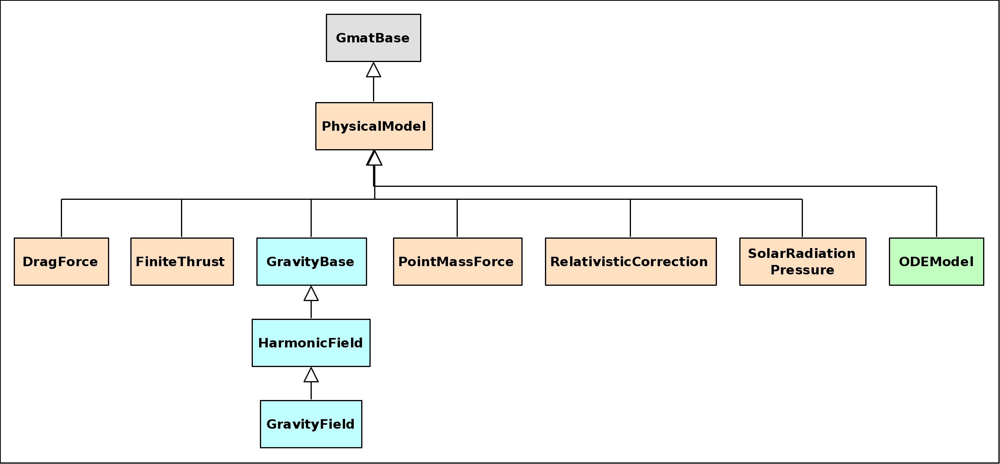

*******************************************
Multibody Gravity Design and Implementation
*******************************************
The code implementing full field gravity modeling for more than one body is built on the code for full field gravity for a  single body.  GMAT's implementation of that model is documented separately.  :numref:`GMATForces` shows the classes in GMAT that are used to model the dynamics of a trajectory.  The full field gravity components are highlighted in blue.  The class used to accumulate forces, the ODEModel, is highlighted in green.

.. _GMATForces:

    The force/dynamics model classes in GMAT

The PhysicalModel class shown in the figure defines the interfaces used for dynamics modeling.  Each class shown below that base class implements an element of the modeling.  GMAT's numerical integrators use an ODEModel object to retrieve the state vector derivatives - e.g. the accelerations to be applied - through a member method, GetDerivatives(), that implements the superposition of derivatives for the state vector :math:`\textbf{r}`:

.. math::

    {{d\textbf{r}}\over{dt}} = \sum_{i=1}^n \left({{d(\textbf{r})}\over{dt}}\right)_i

Each element :math:`i` in the sum on the right hand side generates the time derivative of the state vector for a specific type of dynamics model - that is, for drag, or for point masses, or active thrusters, and so forth.  The state vector :math:`\textbf{r}` in this equation is typically the position and velocity of the spacecraft.  It includes the mass when finite burns are active, and the state transition matrix if it has been turned on by the user.  The derivative data for a given component of the sum is computed in the code by calling the GetDerivatives() method on that component.  For the purposes of this piece of the design, the dynamics will be simplified to only consist of GravityField constituents.  Readers of this design document should keep in mind that the descriptions here present the full field gravity elements, which are a portion of the total model.

Code Changes Required
=====================
GMAT R2020a and earlier enforced a "Single instance per propagator" rule on the force model used for numerical integration.  That rule was triggered when a force was added to the force model in the ODEModel::AddForce() method.  This implementation removes that restriction, and adds bookkeeping to track central bodies for each full field model added to the system.

One side effect of the single instance code is that the script interpreter in GMAT has a cheat built into parsing for lines like

.. code-block:: matlab
   :linenos:

   EarthMoonProp_ForceModel.GravityField.Earth.Degree = 12;
   EarthMoonProp_ForceModel.GravityField.Earth.Order = 12;
   ...

The script interpreter treats multilevel field designations (e.g. "GravityField.Earth.Degree") as a single level, stripping off the first two blocks and passing the trailing piece ("Degree" for this example) to the object when an ID is needed.  This results in errors like reported in GMT-7685.  The issue is addressed in the new code through the introduction of a new method

.. code-block:: cpp
   :linenos:

   bool HasDecoratedFields()

on the GmatBase class.  This method returns false (the default) if the object expects a single field label in calls to GetParameterID(const string label), and true (implemented in a method overload) if the object can handle the more complex - "decorated" - field names.  The code update for multibody gravity uses this mechanism in the ODEModel class to manage settings for each of its full field gravity models.  Interested developers should read the ODEModel\:\:GetParameterID method to see one approach to managing this type of setting.
