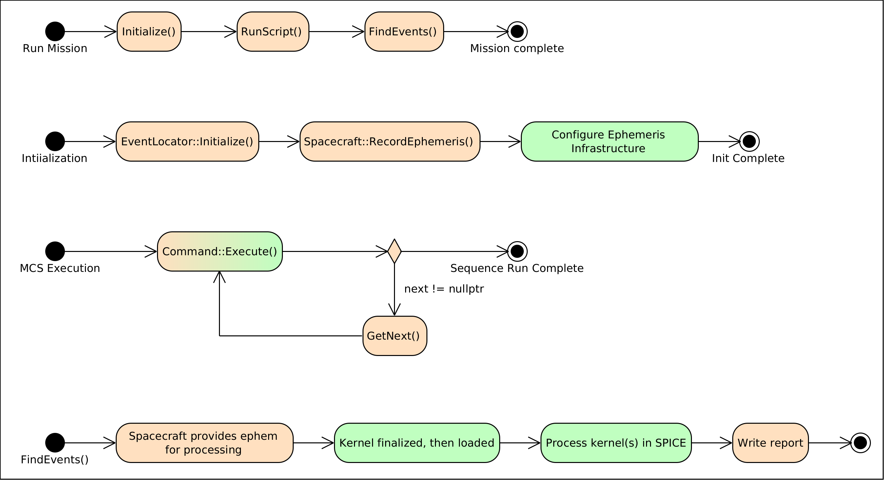
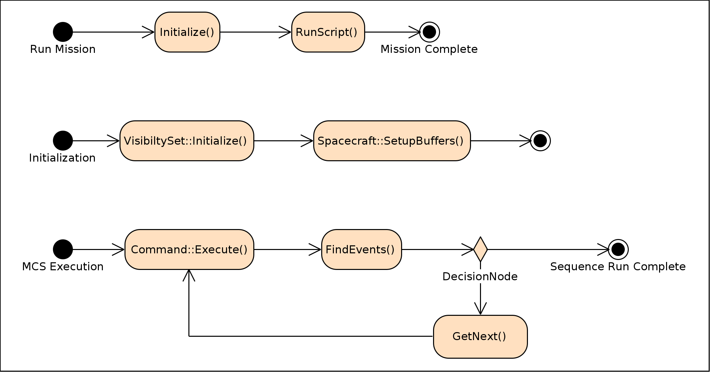

Sensor Design
=============
.. note::
   GMAT R2020a added the ability to display sensor masks and cones in the OpenFramesInterface (OFI) component.  The field of view code used for this feature is in the GMAT code base, providing a framework for the new sensor features described here.  The integration of the field of view component into GMAT R2020a is limited to use in the OFI graphics, and will be updated from the R2020a baseline code to provide the sensor capabilities described here.  :ref:`Baseline` documents the R2020a code for reference purposes.

This chapter documents two separate design approaches for GMAT's sensor access reporting features.  The core capability covered in these options reproduces the current GMAT contact reporting, applied to sensor objects either on spacecraft or on ground stations.  Either design can be extended to other object types if needed.  The core design difference between these two approaches is the timing for performing the contact calculations, and the implications that arise from that timing.  

The first approach uses the SPICE toolkit from the Navigation and Ancillary Information Facility (NAIF) at JPL to compute contact data from a temporary spacecraft kernel (SPK) ephemeris generated from a mission control sequence run.  This approach benefits from the proven capabilities of the SPICE tool kit for the contact data generation, and from leveraging existing contact location and intrusion detection code in GMAT to the domain of attached sensor hardware.  

The second approach builds the contact data generation into GMAT.  The key benefit to this approach is that it provides GMAT users with the ability to compute contact data during the mission run and to react to that contact information during the script run.  That enables control logic capabilities in GMAT that otherwise requires scripting by a knowledgeable user, and that scales better to many-on-many types of analysis problems than does a script based approach.

Scripting
---------
Scripting for the sensor modeling in GMAT builds from a set of core components and adds features to those components to meet the needs of the current simulation.  The core objects used in the script - Spacecraft and GroundStations - should be familiar to users of GMAT, so only the features of those objects relevant to sensor usage are presented below.  Additionally, scripting for the visualization aspects of these objects is not shown in the core scripting presented here.  That scripting can be found :ref:`elsewhere<Visualization>`.

Object scripting
****************
Sensor usage and access reporting is built in GMAT using a collection of resources, coupled together to provide the needed results.  The GMAT simulation connects to these objects through either a Spacecraft or GroundStation participant.  These owning objects add sensor resources that are configured to model the characteristics of the measurement or access that is being modeled.  The area that the sensor can detect -- the "viewing region" in what follows -- can be a conical volume of space, a pyramid shaped "rectangular" region, or a volume defined by a polygon defined by a set of vectors (for the SPICE based approach 1) azimuth-elevation mask (for the internal code in approach 2).  Additional viewing regions may be added over time, based on user needs.  These viewing regions are defined using the existing field-of-view objects.

The following text describes the configuration of these resources in GMAT.  The use of these resources is described in :ref:`SensorUsage`.

**Access Participants**

Sensors can be placed on ground stations and on spacecraft.  :numref:`StationSensorScripting` shows the basic configuration of a ground station that uses an elevation mask (described below) for contact analysis.  Note that in this listing, the sensor orientation is built around a zenith pointing boresight direction and a north pointing azimuth reference direction.  Sensors at ground stations are located by default at the station location.

.. _StationSensorScripting:
.. code-block:: matlab
   :caption: Sample scripting for a Sensor object on a GroundStation
   :linenos:

   Create GroundStation station
   station.AddHardware = {dish}

   Create Sensor dish;
   dish.FieldOfView = mask;

:numref:`SpacecraftSensorScripting` shows the basic configuration of a sensor used by a spacecraft.  The spacecraft object, "sat," is assigned the sensor "sensor1" using the AddHardware line in the script.  That sensor is built and configured with its location, pointing direction, and orientation, along with a field of view that defines the region of space that the sensor uses to detect objects.

.. _SpacecraftSensorScripting:
.. code-block:: matlab
   :caption: Sample scripting for a Sensor object on a Spacecraft
   :linenos:

   Create Spacecraft sat;
   sat.AddHardware = {sensor1}

   Create Sensor sensor1;
   sensor1.FieldOfView = fov1;
   % Sensor location in BCS coordinates
   sensor1.HWOriginInBCSX = 0.001;
   sensor1.HWOriginInBCSY = 0.00025;
   sensor1.HWOriginInBCSZ = 0.00025;
   % Sensor boresight along the BCS X-axis
   sensor1.DirectionX = 1.0;
   sensor1.DirectionY = 0.0;
   sensor1.DirectionZ = 0.0;
   % Set the sensor "up" direction along the BCS Z-axis
   sensor1.SecondDirectionX = 0.0;
   sensor1.SecondDirectionY = 0.0;
   sensor1.SecondDirectionZ = 1.0;

   sensor1.IsActive = True;

The default settings for a spacecraft sensor place the location of the sensor at the owning object's center of mass, with the boresight directed along the body coordinate system (BCS) X-axis and the up direction pointed in the BCS Z-direction.

The IsActive setting on Sensor objects is used to turn a Sensor on or off.  This setting defaults to True, but can be changed in the mission timeline to meet the needs of the simulation.

.. note::
   Note that the scripting listed here reflects current (GMAT R2020a) scripting.  During implementation, the development team may update the scripting for Sensor objects as follows:

    .. code-block:: matlab

      Create Sensor sensor1;
      ...
      sensor1.LocationX = 0.001;
      ...
      sensor1.BoresightX = 1.0;
      ...
      sensor1.UpDirectionX = 0.0;
      ...
      
   If this change is implemented, both versions will function in the code through the use of aliased parameter names.  The text written to script when saved from the object settings (e.g., by pressing the "Save" button on the toolbar) will use the preferred settings.

All of the position and direction data in this scripting is referenced to the owning object's body-coordinate system.  Distance measurements here, as in most of GMAT, are specified in kilometers.  The pointing direction for a sensor attached to a spacecraft is set using this BCS based vector, rotated into the reference frame of the simulation using the spacecraft's attitude settings.

**Fields of View**

The viewing region visible to a sensor is defined using a field of view (FOV) object.  GMAT supports several different FOV object types.  The simplest of these is the conical FOV.  :numref:`ConicalFieldOfViewScripting` shows the scripting defining a basic 1.5 degree sensor that reports contacts from 1000 to 25000 km away from the sensor. 

.. _ConicalFieldOfViewScripting:
.. code-block:: matlab
   :caption: Sample scripting for a Conical Field-of-View
   :linenos:

   Create ConicalFOV fov1;
   fov1.MinRange = 1000;          % Default: 0.0
   fov1.MaxRange = 25000;         % Default: Effectively infinite
   fov1.FieldOfViewAngle = 1.5;   % Default: 30.0

Some sensors are best represented using a rectangular viewing region.  :numref:`RectFieldOfViewScripting` shows the scripting that builds this type of viewing region, extending from the sensor to infinity.  The viewing region defined by this scripting has a swath width extending from -45 degrees to 45 degrees from the boresight, with leading and training edges 3 degrees from the boresight in the sensor's "up" direction.

.. _RectFieldOfViewScripting:
.. code-block:: matlab
   :caption: Sample scripting for a Rectangular Field-of-View
   :linenos:

   Create RectangularFOV rectFOV;
   GMAT rectFOV.AngleWidth = 45;
   GMAT rectFOV.AngleHeight = 3;

More complicated viewing regions are configured using a mask build through cone angles set at specific clock angles.  The clock angle is measured from the sensor's up direction vector.  One such viewing region is shown in :numref:`MaskFieldOfViewScripting`.  This scripting creates a viewing region with an arrow shaped footprint and a range of 42165 km.  For the SPICE approach to contact location, these mask settings are converted into the vector based polygonal inputs used in the SPICE code.

.. _MaskFieldOfViewScripting:
.. code-block:: matlab
   :caption: Sample scripting for a Masked Field-of-View
   :linenos:

   Create CustomFOV ArrowFOV;
   GMAT ArrowFOV.ConeAngles = [ 15 15  8    15  15   8  15 ];
   GMAT ArrowFOV.ClockAngles = [ 0 90 90.1 150 210 270 270.1 ];
   GMAT ArrowFOV.MaxRange = 42165;

.. note::
   Note that the scripting listed here reflects current (GMAT R2020a) scripting.  During implementation, the development team may update the scripting for custom fields of view as follows:

    .. code-block:: matlab

       Create CustomFOV stationFOV;
       GMAT stationFOV.AzimuthAngles   = [ 0 90 170 171 189 190 270 ];
       GMAT stationFOV.ElevationAngles = [ 7 7  7   15  15  7   7 ];
       GMAT stationFOV.MaxRange = 42165;
      
   If this change is implemented, both versions will function in the code through the use of aliased parameter names.  The use of explicit azimuth and elevation angles in the mask definition is consistent with common usage for ground station masking applications.  The text written to script when saved from the object settings (e.g., by pressing the "Save" button on the toolbar) will use the preferred settings. 

.. _SensorUsage:

Sensor Usage
************
GMAT users configure sensor access settings through a pair of configuration objects.  The first of these objects - the "VisibilitySet" - is used to define the objects the sensor is set to detect. The second - the "SensorConstraint" object - defines the environmental factors that the sensor must include in the detection process.  It identifies environmental features that affect the object detection like intervening bodies and objects that may blind the sensor.  :numref:`AccessConfiguration` shows how the user defines these settings.

.. _AccessConfiguration:
.. code-block:: matlab
   :caption: Sensor Constraint Resources
   :linenos:

   % Identify the sensor and the objects that it is detecting
   Create VisibilitySet vs
   GMAT vs.Constraint = {scon}
   GMAT vs.Sensor     = {sat.sensor1}
   GMAT vs.Targets    = {MoonBase, station.dish, sat2}

   % Create the set of viewing assets
   Create SensorConstraint scon
   GMAT scon.IntrudingBodies = {Sun}
   GMAT scon.IntrusionAngle  = 2.5      % Make this an array, 1:1 with bodies?
   GMAT scon.OccultingBodies = {Earth, Moon}
   GMAT scon.LightTime       = true

The VisibilitySet object identifies the participants in a sensor access calculation.  The configuration shown here uses a previously defined SensorConstraint to define valid signals, and computes when any of 3 objects -- MoonBase, the dish sensor on the station object, or sat2 -- is visible to sensor1 on the sat object.  These objects are the set in the Targets field.  Any GMAT object that has location data can be set as a target in the VisibilitySet.  The VisibilitySet Target field can include GMAT's Formation container as well, providing a convenient mechanism to instruct GMAT to scan through a collection of spacecraft using a single setting.  The SensorSet uses a list to determine the sensors participating in the computation as well, set in the Sensor field.  Multiple sensors can be set to seek the target list using this setting.  The Constraint field identifies the environmental constraints that GMAT uses when it assesses accesses between a sensor and a target object.

The SensorConstraint resource defines a set of constraints that the user wants to apply to one or more sensors.  This object holds general purpose settings for access calculations applied to the sensors.  In the example in the listing, the sensors that use the SensorConstraint scon will treat any access within 2.5 degrees of the Sun as invalid.  A pass that would include access that passes through this conical region reports loss of signal or acquisition of signal at this 2.5 degree boundary.  Similarly, if the Earth or Moon intrudes on the signal path between the sensor and the target object, a signal path (AOS or LOS) event occurs at the point at which the intruding body prevents line-of-sight between the objects.  In the example here, the signal path also takes into account the motion of the objects during the signal transmission - that is, the light travel time for the signal from the target object to the sensor is used to adjust the location of the target relative to the sensor.  Setting the LightTime field to true activates computation of access starting from the location of a target object at the time that the detected signal leaves the target, and ending at the sensor located at its position at the time of signal arrival.  If the LightTime field is false, the signal path is geometric - the locations of the target and sensor are identical, and no light travel time is taken into account. 

Reporting
*********
Users can use the general read-only parameters on VisibilitySet objects to write data to GMAT report files.  The system includes a more general purpose configuration object to define usage computation and reporting options, along with a set of commands to trigger use of that configuration.  The SensorReport object is used to create a report of sensor events across the run of a script.  The scripting for the sensor computations, shown in :numref:`SensorReportConfig`, shows how to set up the SensorReport for a run.

.. _SensorReportConfig:
.. code-block:: matlab
   :caption: Report Definition Configuration for Sensor Reporting
   :linenos:

   Create SensorReport accesses
   GMAT accesses.Filename = 'SensorData.txt'
   GMAT accesses.VisibilitySets = {vs}
   GMAT accesses.IncludeRange = True
   GMAT accesses.ReportAOS = True
   GMAT accesses.ReportLOS = True
   GMAT accesses.ReportPassData = True
   GMAT accesses.PassInterval = 30.0
   GMAT accesses.IncludeApex = True

This feature of the system behaves similarly to GMAT's event locators.  When a SensorReport object is created in a GMAT script, the report is generated when the script is run.  SensorReports behave similarly to other GMAT output ("Subscriber") objects.  For example, the sensor report can be toggled on or off in the script using the "Toggle" command.

Run-time Processing (Design 2 only)
***********************************
For design option 2, the components described above can be used during a mission run to trigger actions taken in the mission timeline.  :numref:`SensorActions` shows an example of writing report data based on visibility between a spacecraft sensor and one of a group of other objects that the user is interested in observing.  The Access field on a visibility set returns true when a sensor in a VisibilitySet can see one or more of the targets in the set, applying any SensorConstraints that are part of the set.  The VisibleObjects field returns the list of all objects that can be seen by a sensor in the set.  (The Access and VisibleObjects fields are both read-only fields for the VisibilitySet.)

.. _SensorActions:
.. code-block:: matlab
   :caption: Run-Time Sensor Constraint Use
   :linenos:

   Create ReportFile RF;

   % Now run with these assets
   BeginMissionSequence
   ...
   If vs.Access
      Report RF vs.VisibleObjects
   EndIf

The VisibilitySet object provides access to the information for specific sensors using GMAT's 2-dot scripting syntax.  For example, if a user scripts

.. code-block:: matlab
   :caption: Constraint Use for a Specific Sensor
   :linenos:

   Create ReportFile RF;

   % Now run with these assets
   BeginMissionSequence
   ...
   If vs.sensor1.Access
      Report RF vs.sensor1.VisibleObjects
   EndIf

the system reports the object visible to sensor 1 in the VisibilitySet.

.. _CodeOptions:

Code Options
------------
The sensor access reporting can be implemented using either of two approaches documented here.  The first approach leverages the existing SPICE based event location code, adding the capability to perform post processing for object to sensor signals so that reports of objects seen by configured sensors can be generated.  The second approach performs sensor access calculations as the mission control sequence is running, enabling scripted responses to sensor accesses while the trajectory is being generated.  Either approach meets the reporting requirements for sensor access in GMAT, assuming that there is no need for orbit or attitude response to sensor access detection while a mission is being run.

Design Option 1: SPICE Processing
*********************************
Sensor access processing using the SPICE library is based on the contact location and eclipse location code in GMAT.  That code is described in [Parker]_.  

Implementation of option 1 adds a new class to GMAT derived from the existing EventLocator base class.  The AccessReport class manages collection of data during execution of the mission control sequence by configuring the SPICE kernel resources used to generate the raw data collection necessary for post processing of the data to produce the contact data reports.  The AccessReport configures SPICE kernel generation for the following data sets:  

* Each spacecraft used in the AccessReport generates a temporary SPK file.
* Each ground station used in the AccessReport generates temporary SPK and FK files.
* Each spacecraft identified as a sensor owner generates an IK kernel for each of its reporting sensors, any sensor specific frame kernels (FKs) needed, and an attitude (CK) kernel for the spacecraft.
* Each ground station identified as a sensor owner generates an IK kernel for each of its reporting sensors.  Sensors located coincident to ground stations use the FK frame for the ground station, so there is no attitude equivalent file required for the station.  Sensors offset from the station location may require an additional frame kernel (FK).

These kernels are populated with data as the mission control sequence executes.  Once the mission control sequence has run, the AccessReport object finalizes and loads the temporary kernels into memory, and then calls the SPICE libraries to generate contact event data.  When SPICE has completed processing, the AccessReport steps through the event data and writes the sensor access report.  This can produce a significant lag between when GMAT completes the control sequence execution and the time the run finishes execution.

:numref:`SPICEContacts` shows the process flow employed by this approach.  In the figure, actions shaded in green represent processing that are performed by the SPICE system.  Those in orange are performed by GMAT.  The basic processes is as follows:

#. The user starts a script that includes sensor access calculations.
#. GMAT performs initialization of the objects in the script.  

   A. This includes initialization of the AccessReport event locator and its related classes.
   #. The event locator turns on orbit ephemeris (SPK) generation for each spacecraft involved in the sensor access calculations.  Spacecraft that have sensors involved in access calculations also turn on attitude kernel (IK and CK) generation.
   #. Activation of the SPICE file generation code sets up spacecraft kernel generation for each spacecraft, assigning a globally unique name to each kernel that is to be generated.

#. The mission control sequence executes.  As each command executes, those that publish data send spacecraft states to the kernel writing code.
#. Once the last command in the mission control sequence finishes executing, the post processing step begins through a call to the locator's FindEvents() method.

   A. For each spacecraft involved in the sensor access calculations, the locator accesses the name of its temporary SPK kernel.
   #. The kernel file is finalized and closed for writing, making it available for loading into the SPICE engine.
   #. The kernel is added to the SPICE kernel pool, loading the kernel into memory.
   #. SPICE is instructed to generate the sensor access data.
   #. The resulting data is written to a GMAT output file.

#. The run is finalized, completing processing.

.. _SPICEContacts:

   Event processing for sensor contacts: Processing with SPICE

.. [Parker] \J. Parker, *GMAT Event Location Design Spec Spec*, 2015.  Available at `GoogleDocs <https://docs.google.com/document/d/1qWVsxxmEO63rHB-gzRwUKMGzxfQazgLMq_nXbwD9VWI/edit#>`_.

Design Option 2: Internal Processing
************************************
A second option for meeting the sensor access requirements is to build the access reporting into GMAT.  Implementation of option 2 adds a new Subscriber to GMAT that encapsulates the sensor access reporting functions, and a set of parameters that are used to generate the data that can also be used external to the AccessReport subscriber for decision logic or for reporting as isolated data points.  This approach requires the following extensions to GMAT objects to facilitate access reporting:

* The Spacecraft objects need to include a ring buffer that stores orbital state data for a sufficient duration that light time iterations can be performed, interpolating the buffered states during the iteration.  (Light transit time from Pluto to Earth is approximately 5.5 hours.  A one day buffer should be sufficient for GMAT's purposes.)
* The field-of-view numerical code needs to be integrated into GMAT.  As of GMAT R2020a, this code is already in the code base, but the CheckTargetVisibility() methods are unused.

Option 2 performs access computations as the mission control sequence runs.  The data is available for processing as part of the run and for display in plots and data display windows.  As long as GMAT keeps these calculations in the main (single threaded) GMAT environment, run times for the main sequence will take longer as a result of these added computations.

:numref:`InternalContacts` shows the program flow for internal processing in GMAT.  The procedure is similar to that followed for SPICE processing at the start, but differs during the script execution:

#. The user starts a script that includes sensor access calculations.
#. GMAT performs initialization of the objects in the script.  

   A. The AccessReport subscribers are initialized.
   #. The VisibilitySet objects are initialized.
   #. Each VisibilitySet turns on orbit state buffering for the spacecraft identified as targets in the sensor access calculations.

#. The mission control sequence executes.  

   A. As each command executes, those that publish data also buffer the publisher data for each target spacecraft, using a ring buffer.
   #. Subscribers that report sensor accesses compute and report their access data.

      #. Light time iteration is performed as needed for the generated data, interpolating the buffered state data.
   
   #. Parameters that use sensor accesses are evaluated.

#. The run is finalized, completing processing.

.. _InternalContacts:

   Event processing for sensor contacts: Internal processing

