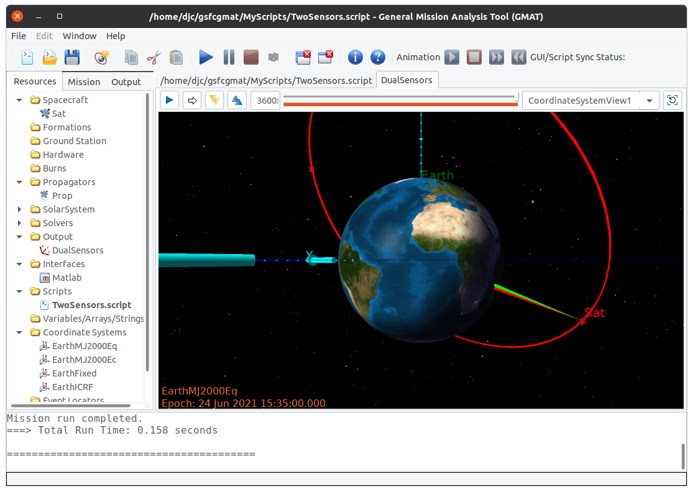

.. _Baseline:

GMAT R2020a Baseline
====================
GMAT R2020a has a partial sensor implementation, using the navigation plugin's Antenna as the hook for sensor fields of view.

Scripting
---------

.. _R2020aScripting:
.. code-block:: matlab
   :caption: Sample scripting for a 2-sensor spacecraft in GMAT R2020a
   :linenos:

	%----------------------------------------
	%---------- Spacecraft and Hardware
	%----------------------------------------
	Create Spacecraft Sat;
	GMAT Sat.DateFormat = UTCGregorian;
	GMAT Sat.Epoch = '23 Jun 2021 15:35:00.000';
	GMAT Sat.CoordinateSystem = EarthMJ2000Eq;
	GMAT Sat.DisplayStateType = Keplerian;
	GMAT Sat.SMA = 12000;
	GMAT Sat.ECC = 0.3;
	GMAT Sat.INC = 52;
	GMAT Sat.RAAN = 0;
	% NOTE: No attachment needed
	% GMAT Sat.AddHardware = {Sensor1, Sensor2};
	GMAT Sat.Attitude = NadirPointing;

	Create Antenna Sensor1 Sensor2;
	GMAT Sensor1.DirectionX = 1;
	GMAT Sensor1.DirectionY = 0;
	GMAT Sensor1.DirectionZ = 0;
	GMAT Sensor1.HWOriginInBCSX = 0;
	GMAT Sensor1.HWOriginInBCSY = 0;
	GMAT Sensor1.HWOriginInBCSZ = 0;

	GMAT Sensor2.DirectionX = 1;
	GMAT Sensor2.DirectionY = 0.05;
	GMAT Sensor2.DirectionZ = 0;
	GMAT Sensor2.HWOriginInBCSX = 0;
	GMAT Sensor2.HWOriginInBCSY = 0;
	GMAT Sensor2.HWOriginInBCSZ = 0;

	Create ConicalFOV Fov1 Fov2;
	GMAT Fov1.FieldOfViewAngle = 1;
	GMAT Fov1.Color = [255 0 0];
	GMAT Fov2.FieldOfViewAngle = 1;
	GMAT Fov2.Color = [0 255 0];

	GMAT Sensor1.FieldOfView = Fov1;
	GMAT Sensor2.FieldOfView = Fov2;

	%----------------------------------------
	%---------- Propagation Components
	%----------------------------------------
	Create ForceModel Prop_ForceModel;
	GMAT Prop_ForceModel.CentralBody = Earth;
	GMAT Prop_ForceModel.PrimaryBodies = {Earth};

	Create Propagator Prop;
	GMAT Prop.FM = Prop_ForceModel;
	GMAT Prop.Type = PrinceDormand78;

	%----------------------------------------
	%---------- Visualization
	%----------------------------------------
	Create OpenFramesInterface DualSensors;
	GMAT DualSensors.Add = {Sat, Earth, Luna, Sun};
	GMAT DualSensors.SensorMask = {Sensor1Cone, Sensor2Cone};
	GMAT DualSensors.View = {CoordinateSystemView1, SatView1};

	Create OpenFramesView SatView1;
	GMAT SatView1.ViewFrame = Sat;

	Create OpenFramesView CoordinateSystemView1;
	GMAT CoordinateSystemView1.ViewFrame = CoordinateSystem;
	GMAT CoordinateSystemView1.SetDefaultLocation = On;
	GMAT CoordinateSystemView1.DefaultEye = [ -20000 20000 0 ];
	GMAT CoordinateSystemView1.DefaultCenter = [ 0 0 0 ];
	GMAT CoordinateSystemView1.DefaultUp = [ 0 0 1 ];
	GMAT CoordinateSystemView1.FOVy = 45;

	Create OpenFramesSensorMask Sensor1Cone;
	GMAT Sensor1Cone.Source = Sat;
	GMAT Sensor1Cone.Hardware = Sensor1;
	GMAT Sensor1Cone.LengthType = Manual;
	GMAT Sensor1Cone.Length = 12000;

	Create OpenFramesSensorMask Sensor2Cone;
	GMAT Sensor2Cone.Source = Sat;
	GMAT Sensor2Cone.Hardware = Sensor2;
	GMAT Sensor2Cone.LengthType = Manual;
	GMAT Sensor2Cone.Length = 12000;

	%----------------------------------------
	%---------- Mission Sequence
	%----------------------------------------
	BeginMissionSequence;
	Propagate Prop(Sat) {Sat.ElapsedDays = 1.0};

.. _R2020aVisualization:

   The script in :numref:`R2020aScripting`, run in GMAT R2020a 
