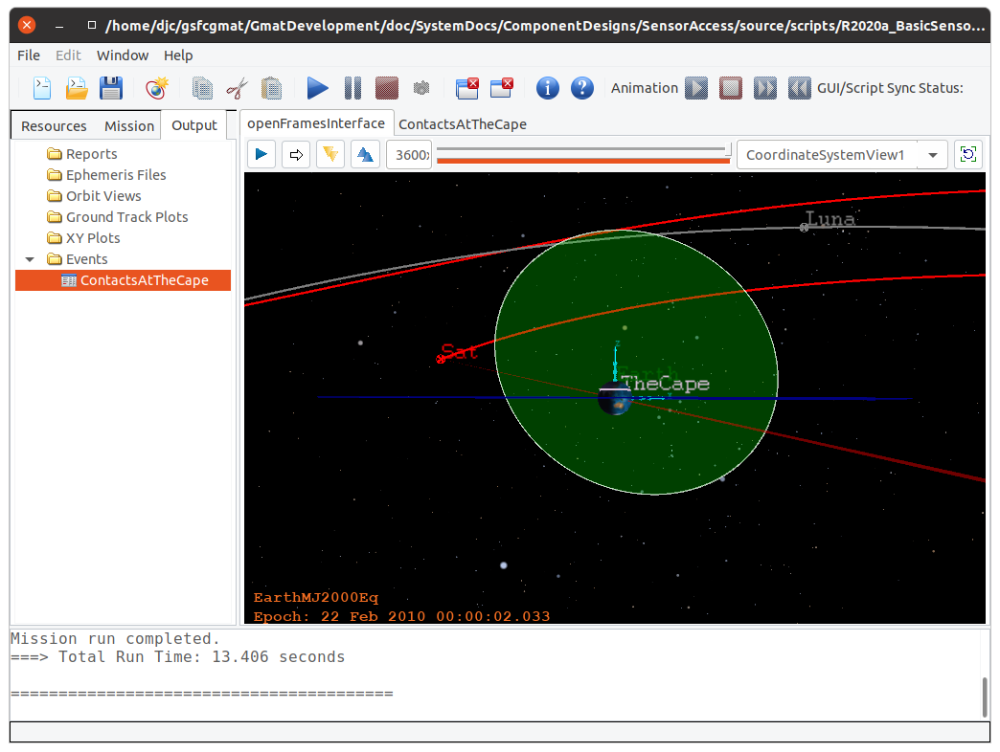
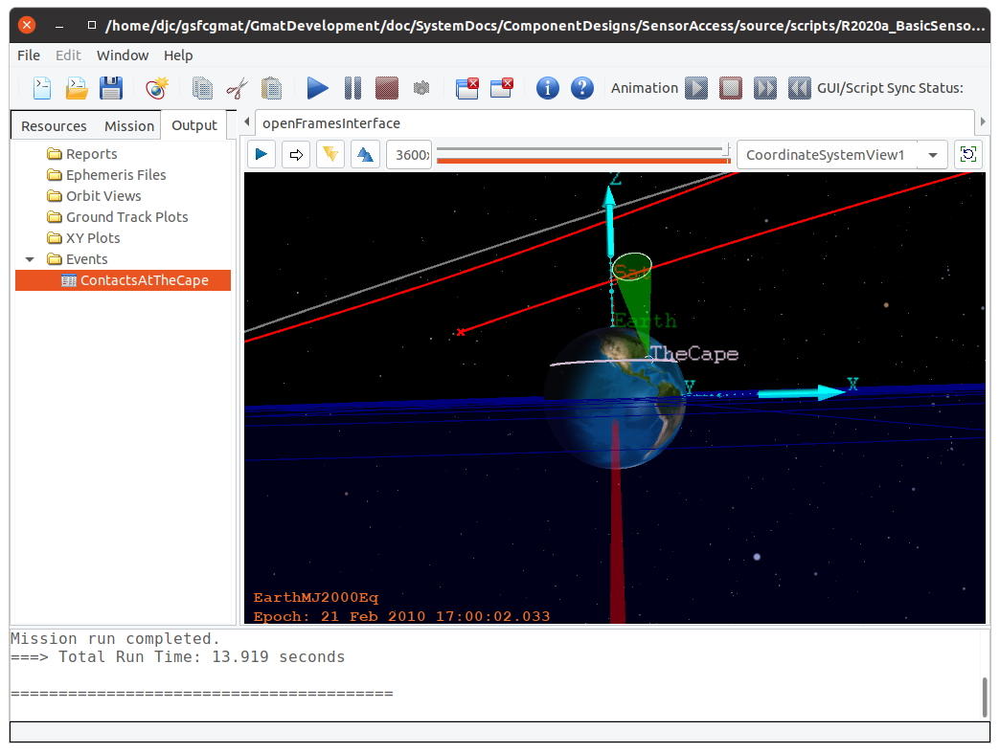

.. _VisualizationScripting:

***********************************
Reference Capabilities: GMAT R2020a
***********************************

The current scripting for contact reporting is shown in :numref:`CurrentScripting`\ .  The script shown there is a fully functional script, configured both to report the numerical contact time data and to display sensors cones in a trajectory view.  For brevity, all sensors configured in this example are set to use a conical fields of view.  The current GMAT scripting also allows for a rectangular field of view, and for a field of view set as a sequence of cone angles at user specified clock angles around the sensor boresight. 

Baseline GMAT script
--------------------
The spacecraft modeled in this script starts on an Earth-Moon L2 lissajous and propagates 30 days from that initial state without any stationkeeping adjustments.  The spacecraft is configured to point a 0.1 degree sensor at the Earth nadir point throughout this propagation.

The ground station in this script is set at station A40P at Cape Canaveral, Florida.  The station is assigned a 10 degree station elevation angle.  The visualization uses a corresponding 80 degree cone angle.

.. _CurrentScripting:
.. code-block:: matlab
	:caption: Full function GMAT R2020a script, with Ground Station and Spacecraft Sensor Visualization and Reporting
	:linenos:

	% Spacecraft at Earth-Moon L2
	Create Spacecraft Sat;
	GMAT Sat.DateFormat = UTCGregorian;
	GMAT Sat.Epoch = '23 Jan 2010 00:00:02.033';
	GMAT Sat.CoordinateSystem = EarthMJ2000Eq;
	GMAT Sat.DisplayStateType = Cartesian;
	GMAT Sat.X = 406326.226613191;
	GMAT Sat.Y = 177458.3876159782;
	GMAT Sat.Z = 145838.5807900441;
	GMAT Sat.VX = -0.5172746738228751;
	GMAT Sat.VY = 0.7746503665608931;
	GMAT Sat.VZ = 0.3314166026539857;

	% Station in Florida
	Create GroundStation TheCape;
	GMAT TheCape.CentralBody = Earth;
	GMAT TheCape.StateType = Spherical;
	GMAT TheCape.HorizonReference = Ellipsoid;
	GMAT TheCape.Location1 = 28.5619894;
	GMAT TheCape.Location2 = 279.4228064;
	GMAT TheCape.Location3 = -0.01451;
	GMAT TheCape.MinimumElevationAngle = 10;

	% Propagator Setup
	Create ForceModel FM
	GMAT FM.CentralBody = Earth;
	GMAT FM.PrimaryBodies = {Earth};
	GMAT FM.PointMasses = {Luna, Sun};

	Create Propagator prop;
	GMAT prop.FM = FM;
	GMAT prop.Type = PrinceDormand78; 
	GMAT prop.InitialStepSize = 60;
	GMAT prop.Accuracy = 1e-12;
	GMAT prop.MinStep = 0;
	GMAT prop.MaxStep = 600;
	GMAT prop.MaxStepAttempts = 50;
	GMAT prop.StopIfAccuracyIsViolated = true;

	% ------------------------------------------
	% Visualization Scripting: Spacecraft

	GMAT Sat.Attitude = NadirPointing;
	GMAT Sat.AddHardware = {EarthPointingCone}

	Create Antenna EarthPointingCone;
	GMAT EarthPointingCone.FieldOfView = SatEarthCone;
	GMAT EarthPointingCone.DirectionX = 1;
	GMAT EarthPointingCone.DirectionY = 0;
	GMAT EarthPointingCone.DirectionZ = 0;
	GMAT EarthPointingCone.SecondDirectionX = 0;	% Ignored for cone
	GMAT EarthPointingCone.SecondDirectionY = 0;
	GMAT EarthPointingCone.SecondDirectionZ = 1;
	GMAT EarthPointingCone.HWOriginInBCSX = 0;
	GMAT EarthPointingCone.HWOriginInBCSY = 0;
	GMAT EarthPointingCone.HWOriginInBCSZ = 0;

	Create ConicalFOV SatEarthCone;
	GMAT SatEarthCone.Color = [255 0 0];
	GMAT SatEarthCone.Alpha = 64;
	GMAT SatEarthCone.FieldOfViewAngle = 0.1;

	% ------------------------------------------
	% Visualization Scripting: Station

	GMAT TheCape.AddHardware = {TenDegreeAntenna};

	Create ConicalFOV TenDegEl;
	GMAT TenDegEl.Color = [0 255 0];
	GMAT TenDegEl.Alpha = 64;
	GMAT TenDegEl.FieldOfViewAngle = 80;

	Create Antenna TenDegreeAntenna;
	GMAT TenDegreeAntenna.FieldOfView = TenDegEl;
	GMAT TenDegreeAntenna.DirectionX = 0;
	GMAT TenDegreeAntenna.DirectionY = 0;
	GMAT TenDegreeAntenna.DirectionZ = 1;
	GMAT TenDegreeAntenna.SecondDirectionX = 1;	% Ignored for cone
	GMAT TenDegreeAntenna.SecondDirectionY = 0;
	GMAT TenDegreeAntenna.SecondDirectionZ = 0;
	GMAT TenDegreeAntenna.HWOriginInBCSX = 0;
	GMAT TenDegreeAntenna.HWOriginInBCSY = 0;
	GMAT TenDegreeAntenna.HWOriginInBCSZ = 0;

	% ------------------------------------------
	% Setup reporting for the spacecraft entering the station's field of view

	Create ContactLocator ContactsAtTheCape;
	GMAT ContactsAtTheCape.Target = Sat;
	GMAT ContactsAtTheCape.Filename = 'CapeContacts.txt';
	GMAT ContactsAtTheCape.OccultingBodies = {Luna};
	GMAT ContactsAtTheCape.UseLightTimeDelay = true;
	GMAT ContactsAtTheCape.UseStellarAberration = true;
	GMAT ContactsAtTheCape.WriteReport = true;
	GMAT ContactsAtTheCape.RunMode = Automatic;
	GMAT ContactsAtTheCape.UseEntireInterval = true;
	GMAT ContactsAtTheCape.Observers = {TheCape};
	GMAT ContactsAtTheCape.LightTimeDirection = Transmit;

	% Not available: Station visible to the Satellite

	% ------------------------------------------
	% Setup Visualization for the spacecraft and station
	Create OpenFramesInterface openFramesInterface;
	GMAT openFramesInterface.Add = {Sat, TheCape, Earth, Sun, Luna};
	GMAT openFramesInterface.SensorMask = {SatMask, CapeMask};
	GMAT openFramesInterface.CoordinateSystem = EarthMJ2000Eq;

	Create OpenFramesSensorMask SatMask;
	GMAT SatMask.Source = Sat;
	GMAT SatMask.Hardware = EarthPointingCone;
	GMAT SatMask.Label = 'Homewards';
	GMAT SatMask.LengthType = Manual;
	GMAT SatMask.Length = 465000;

	Create OpenFramesSensorMask CapeMask;
	GMAT CapeMask.Source = TheCape;
	GMAT CapeMask.Hardware = TenDegreeAntenna;
	GMAT CapeMask.Label = 'TheCape';
	GMAT CapeMask.LengthType = Manual;
	GMAT CapeMask.Length = 10000;

	% ------------------------------------------
	BeginMissionSequence
	Propagate prop(Sat) {Sat.ElapsedDays = 30}

Baseline Runtime Results
------------------------
This scripting (set to the current implementation) generates an output file showing sensor AOS and LOS times along with pass durations (:numref:`BaselinePassData`\ ).  The data generated in GMAT tabulated each pass of a spacecraft through a conical sensor located at a ground station with a scripted elevation angle.  The acquisition and loss of signal epochs are reported with millisecond precision.  The pass duration is reported to microsecond precision.  The data are generated using the routines in the SPICE toolkit.  Computations account for both light transit time in one direction and for stellar aberration due to the motion of the observer.

.. _BaselinePassData:
.. code-block:: text
	:caption: Station Contact Report Example
	
	Target: Sat

	Observer: TheCape
	Start Time (UTC)            Stop Time (UTC)               Duration (s)         
	23 Jan 2010 00:00:02.033    23 Jan 2010 04:47:11.544      17229.510622    
	23 Jan 2010 17:20:28.686    24 Jan 2010 05:35:18.812      44090.126209    
	24 Jan 2010 17:56:26.891    25 Jan 2010 06:26:39.056      45012.165377    
	25 Jan 2010 18:40:20.622    26 Jan 2010 07:22:07.144      45706.521664    
	26 Jan 2010 19:34:34.454    27 Jan 2010 08:21:24.974      46010.519252    
	27 Jan 2010 20:40:40.952    28 Jan 2010 09:22:40.291      45719.338352    
	28 Jan 2010 21:58:04.344    29 Jan 2010 10:23:19.719      44715.374920    
	29 Jan 2010 23:23:31.535    30 Jan 2010 11:21:40.625      43089.089394    
	31 Jan 2010 00:50:38.214    31 Jan 2010 12:15:31.408      41093.194538    
	01 Feb 2010 02:11:35.081    01 Feb 2010 13:02:50.632      39075.550802    
	02 Feb 2010 03:23:56.160    02 Feb 2010 13:44:16.889      37220.728950    
	03 Feb 2010 04:28:26.254    03 Feb 2010 14:21:22.746      35576.492196    
	04 Feb 2010 05:26:29.979    04 Feb 2010 14:55:40.289      34150.310409    
	05 Feb 2010 06:19:46.159    05 Feb 2010 15:28:38.430      32932.270860    
	06 Feb 2010 07:09:57.208    06 Feb 2010 16:01:49.969      31912.761891    
	07 Feb 2010 07:58:37.199    07 Feb 2010 16:36:57.982      31100.782417    
	08 Feb 2010 08:46:57.384    08 Feb 2010 17:15:57.581      30540.197066    
	09 Feb 2010 09:35:32.258    09 Feb 2010 18:00:50.757      30318.498274    
	10 Feb 2010 10:24:12.533    10 Feb 2010 18:53:32.109      30559.576491    
	11 Feb 2010 11:12:12.061    11 Feb 2010 19:55:30.261      31398.199250    
	12 Feb 2010 11:58:23.152    12 Feb 2010 21:07:45.160      32962.007903    
	13 Feb 2010 12:39:10.548    13 Feb 2010 22:23:14.762      35044.213473    
	14 Feb 2010 13:00:22.366    14 Feb 2010 23:10:24.026      36601.660437    
	15 Feb 2010 13:17:02.164    15 Feb 2010 23:50:15.582      37993.418123    
	16 Feb 2010 13:40:32.853    17 Feb 2010 00:35:27.698      39294.845740    
	17 Feb 2010 14:11:31.372    18 Feb 2010 01:29:26.480      40675.108360    
	18 Feb 2010 14:52:42.602    19 Feb 2010 02:37:48.223      42305.620977    
	19 Feb 2010 15:53:20.479    20 Feb 2010 04:15:07.942      44507.463212    
	20 Feb 2010 17:44:42.887    21 Feb 2010 07:03:21.106      47918.219694    
	21 Feb 2010 22:43:05.156    22 Feb 2010 00:00:01.625      4616.4696568    

	Number of events : 30

The report generated here shown the passes of a specific "Target" spacecraft through the conical field of view os a specific ground station "Observer."  Scripting for the report is on lines 88-98 of :numref:`CurrentScripting`\ , and depends on the elevation angle setting (line 22) assigned to the station.

:numref:`BasicSensorVisualization` shows the sensors in GMAT's OpenFramesInterface window.  The sensor assigned to the spacecraft, EarthPointingCone (shown in red) points directly to the nadir point for the spacecraft with a 0.1 degree cone angle (script line 61).  The cone is set to extend for 465,000 km (line 114).  The sensor assigned to the ground station, shown in green, has a cone angle of 80 degrees (line 71) and displays to a cone height of 10,000 km (line 121).

.. _BasicSensorVisualization:

   Graphics from the basic sensor script

Notes on the Current Configuration
----------------------------------
The current approach separates the configuration of contact reporting and other numerical computations from visualization of sensors in GMAT graphics.  An example of this can be seen when configuring the ground station access report.  Omitting other configuration settings, the contact numerics are set through the lines

.. _StationAccessScripting:
.. code-block:: matlab
	:caption: Lines used to compute access from a station to a spacecraft
	:linenos:

	% Station in Florida
	Create GroundStation TheCape;
	...
	GMAT TheCape.MinimumElevationAngle = 10;

	Create ContactLocator ContactsAtTheCape;
	GMAT ContactsAtTheCape.Target = Sat;
	...
	GMAT ContactsAtTheCape.Observers = {TheCape};

while the sensor graphics are configured through the lines

.. _StationSensorGraphics:
.. code-block:: matlab
	:caption: Lines used to display the sensor mask for a ground station
	:linenos:

	Create GroundStation TheCape;
	...
	GMAT TheCape.AddHardware = {TenDegreeAntenna};

	Create ConicalFOV TenDegEl;
	GMAT TenDegEl.Color = [0 255 0];
	GMAT TenDegEl.Alpha = 64;
	GMAT TenDegEl.FieldOfViewAngle = 80;

	Create Antenna TenDegreeAntenna;
	GMAT TenDegreeAntenna.FieldOfView = TenDegEl;
	GMAT TenDegreeAntenna.DirectionX = 0;
	GMAT TenDegreeAntenna.DirectionY = 0;
	GMAT TenDegreeAntenna.DirectionZ = 1;

	% Setup Visualization for the spacecraft and station
	Create OpenFramesInterface openFramesInterface;
	GMAT openFramesInterface.SensorMask = {CapeMask};

	Create OpenFramesSensorMask CapeMask;
	GMAT CapeMask.Source = TheCape;
	GMAT CapeMask.Hardware = TenDegreeAntenna;
	GMAT CapeMask.LengthType = Manual;
	GMAT CapeMask.Length = 10000;

One feature of the current implementation is the basic disconnect between the station elevation angle setting (:numref:`StationAccessScripting` line 4) and the setting used for the graphics (:numref:`StationSensorGraphics` line 8).  This disconnect makes it possible, in GMAT, for the graphics to represent settings that vary drastically from the numerics.  :numref:`BasicSensorVisualization` configures the numerics and graphics consistently with each other.  :numref:`MisconfiguredSettings` does not; in that figure the graphics are set to display a north pointing 10 degree sensor cone that never intersects the spacecraft orbit.  The output report is generated from the same computation settings as was used for :numref:`BaselinePassData`\ .  The resulting view seen by the user does not match the configuration used to produce mission data.  This misalignment is likely to lead to problems for GMAT users that are not aware of the issue, and is a feature that must be corrected in the updated design.

.. _MisconfiguredSettings:

   Visualization from a poor set of sensor settings
