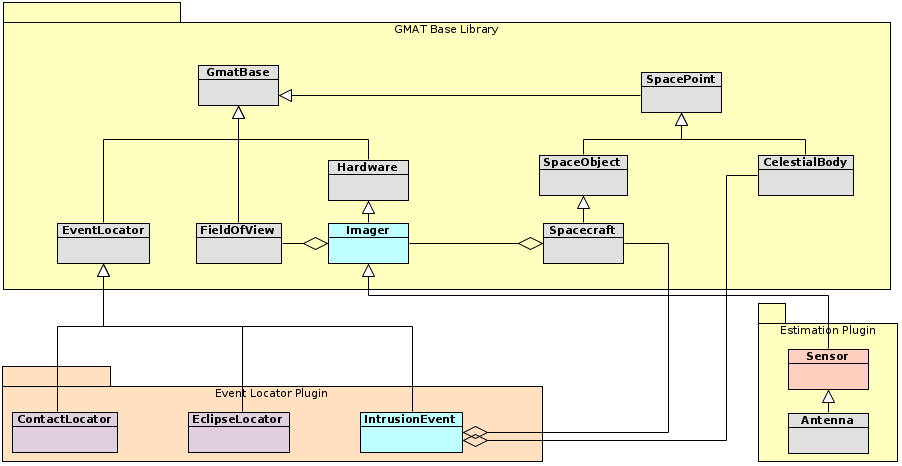
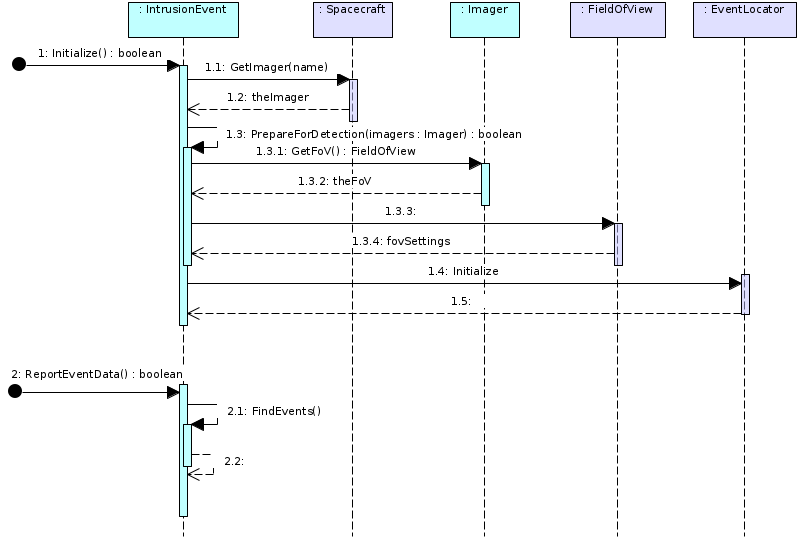

Introduction
============
The GOES-R spacecraft images the full disk of the Earth using its Advanced Baseline Imager (ABI).  From time to time, the Sun or the Moon may intrude on the Imager's field of view.  GMAT includes the capability to identify the time and location of these bodies as they enter the ABI field of view, either by emerging from behind the disk of the Earth or by entering the sensor's view from outside of its field of view.  GMAT reports the entry time, the location of the intruding body across the duration of the intrusion, and the exit time from the field of view.

Requirements
============

GOES-R Requirements
+++++++++++++++++++

The Intrusion report for the Sun and Moon is designed to meet the following user requirements:

#. GMAT will report intrusion events when the Sun or Moon enters the field of view of a sensor.
#. Intrusion event reporting will report the following data: 

   A. The time of entry for the limb of the intruding body into the sensor field of view.
   #. The time of exit for the limb of the intruding body from the sensor field of view.
   #. A time history of the location of the center of the intruding body across the span of the intrusion event.

      #. The time history will be reported at a user specified interval.
      #. The location will be reported as a pair of angles from the spacecraft to the center of the intruding body.
      #. The coordinate system for the angular data is **TBD.**
#. The intrusion report will be made in a format compatible with the GOES ground system.

   A. Formatting of the report will be in a human readable format.
   #. The report may require post processing to convert it into a form compatible with the needs of the ground system.  For example, if an XML format is required, there may be a post processing step that reformats the data into that format.

Future Requirements
+++++++++++++++++++

The design for the sensor intrusion event subsystem focuses on the intrusions from the Sun and Moon for an Earth orbiting spacecraft, but is made taking into account potential future needs in the GMAT system.  The following elements are potential future requirements considered in the design of this component:

#. GMAT will report intrusion events of a body into a sensor field of view for a spacecraft.

   A. Users will specify potential intruding bodies by way of GMAT script settings.
   #. Any user identified intruding body is a GMAT SpacePoint* object.
#. The intrusion report will allow for masking of the intruding body by an intervening body.

   A. The intervening body must be a member of the following groups:

      #. Celestial bodies.

\* SpacePoints in GMAT are objects that have a position and velocity specified by epoch.

Design
======
Users interact with the intrusion reporting components through GMAT scripts.  Those scripts specify how the hardware is configured on the spacecraft, the properties of those sensors, and the bodies to consider in the intrusion reporting.  This scripting is presented first, followed by a description of the system components and their interactions that generate the reports. 

Scripting
+++++++++
GMAT's object model supports sensor intrusions through collaboration between three objects modeling the spacecraft hardware, the propagation subsystem used to model the trajectory as it moves through the mission time line, and an object that generates the intrusion report once propagation has finished.  Scripting for these elements is shown in :numref:`IntrusionScripting`.

.. note::
   The scripting presented here is a draft of the scripting.

   *This note will be removed when the scripting is finalized.*

.. _IntrusionScripting:
.. code-block:: matlab
   :caption: Sample scripting for sensor intrusion reporting
   :linenos:

   % Construct the spacecraft that carries the Imager hardware
   Create Spacecraft GOES17;
   ...
   GMAT GOES17.AddHardware = {ABI};
   GMAT GOES17.Attitude    = NadirPointing;

   % A new GMAT component, used for the sensor settings (name "Sensor" already used)
   % Alternatives: Use "Antenna" object, or relocate the "Sensor" class to base code
   Create Imager ABI;
   GMAT ABI.FieldOfView = ABICone;
   GMAT ABI.Coordinates = FixedGrid;        % Optional, to override S/C origin
   GMAT ABI.SecondDirectionX = 0;
   GMAT ABI.SecondDirectionY = 0;
   GMAT ABI.SecondDirectionZ = 1;
   % Apex of the sensor cone relative to the sensor origin.
   GMAT ABI.HWOriginInBCSX   = 0.0;
   GMAT ABI.HWOriginInBCSY   = 0.0;
   GMAT ABI.HWOriginInBCSZ   = 0.0;

   % Define sensor view characteristics. GMAT can have cones, rectangles, or masks
   Create ConicalFOV ABICone;
   GMAT ABICone.FieldOfViewAngle = 11.50;    % Per GOES team

   % Define the report for the intrusions
   Create IntrusionReporter SunMoonIntrusion;
   GMAT SunMoonIntrusion.Spacecraft           = GOES17;
   GMAT SunMoonIntrusion.Sensors              = {ABI};
   GMAT SunMoonIntrusion.Filename             = 'IntrusionData.txt';
   GMAT SunMoonIntrusion.CentralBody          = Earth;
   GMAT SunMoonIntrusion.IntrudingBodies      = {Luna, Sun};
   GMAT SunMoonIntrusion.MinimumPhase         = 0.1;
   GMAT SunMoonIntrusion.EpochFormat          = 'UTCGregorian';
   GMAT SunMoonIntrusion.StepSize             = 30.0;
   GMAT SunMoonIntrusion.UseLighttime         = true;
   GMAT SunMoonIntrusion.EpochFormat          = 'UTCGregorian';
   GMAT SunMoonIntrusion.UseStellarAberration = true;
   GMAT SunMoonIntrusion.WriteReport          = true;
   GMAT SunMoonIntrusion.RunMode              = Automatic;
   GMAT SunMoonIntrusion.UseEntireInterval    = true;

   % Report Coordinates specify how the data is presented. Subsequent fields 
   % change based on the ReportCoordinates setting
   GMAT SunMoonIntrusion.ReportCoordinates    = 'FixedGrid';
   GMAT SunMoonIntrusion.ReportSMA            = 42166.0;
   % GMAT SunMoonIntrusion.ReportEcc            = 0.0;
   % GMAT SunMoonIntrusion.ReportInc            = 0.0;
   % GMAT SunMoonIntrusion.ReportRAAN           = 0.0;
   % GMAT SunMoonIntrusion.ReportAOP            = 0.0;
   GMAT SunMoonIntrusion.ReportLongitude      = 222.8;  % = 137.2 West long.
   GMAT SunMoonIntrusion.AngleType            = 'NSEW';

   ...

A GMAT user that wants to generate an intrusion report configures a spacecraft and attaches hardware to that spacecraft that models the sensor that may experience interference from other bodies.  GMAT's Antenna component can be used to model the sensor for users that use GMAT's estimation subsystem, or the new Imager component [#f1]_ can be used for this purpose.  The user creates a field of view model for that sensor and attaches it to the sensor using the FieldOfView field on the object.  To summarize the Spacecraft configuration: The Spacecraft has a hardware component attached to it that represents the sensor, and that hardware component has a field of view component that models the sensor's viewing region.

The user then configures an IntrusionReporter object that specifies the types of interference the user wants reported.  The Intrusion reporter identified the spacecraft and sensor that are used in the interference computations using the Spacecraft and Sensor fields on the object.  The intrusion report is written to the file identified by the Filename field.  Computations are performed to detect when any of the celestial bodies listed as IntrudingBodies enter or leave the field of view of the sensor.  The resulting report is written using the specified epoch format, with date written at the epoch of the start of the intrusion, at the interval specified by the StepSize field, and at exit from the sensor's field of view.  When the user specifies a central body for the calculation, that body is used to account for the body intervening in the field of view, providing a cut off of the intrusion as the body blocks the intruding body from the field of view.

The MinimumPhase field specifies the phase, as observed from the spacecraft, of the celestial body that must be illuminated in order for the body to be reported as intruding into the field of view.  GMAT measures the percent illuminated as the percent of the east-west diameter of the body that is illuminated by the Sun [#f2]_.

.. [#f1] The Imager component provides an object to users that do not have the estimation component enabled, and to users that prefer to have an explicit component modeling their sensor. 

.. [#f2] The east-west diameter computation is the method recommended by the U.S. Naval observatory for this measurement. 

Sample Output
+++++++++++++
The example output shown in :numref:`IntrusionExample` shows a sample pass of the Sun through the field of view of the ABI sensor on GOES-17. This example shows the entry and exit times as the Sun enters and leaves the sensor's field of view.  The header information in the file identifies the spacecraft and sensor, along with the coordinate representation used for the report.  The data begins with a header labeling each column in the report.  Each data entry reports the epoch for the data, identifies the intruding body and its angular diameter as seen at the sensor location.  The angular location of the center of the intruding body is then identified in the user specified coordinate frame, along with the illumination proportion for the body, calculated by the ratio of the illuminated angular portion of the east-west chord divided by the angular width of the intruding body.  For a star, the reported illumination is always 1.0, indicating 100% illumination.  The final column identifies the type of data reported, falling into one of three categories: intrusion start, intrusion end, and data collected during the intrusion transit in the field of view.  

.. _IntrusionExample:
.. code-block:: matlab
   :caption: Draft sensor intrusion report

   Spacecraft:   GOES17
   Sensor:       ABI
   Coordinates:  FixedGrid

   Epoch (UTC)                Body     Radius(deg)  NS Coord(deg)    EW Coord(deg)    Illumination    Event
   01 Jan 2021 07:53:15.010   Sun      0.270739      -21.4222        113.7172         1.0000          Intrusion Start
   01 Jan 2021 07:54:15.010   Sun      0.270739      -21.4221        113.9671         1.0000          Intrusion
   ...
   01 Jan 2021 08:55:15.010   Sun      0.270739      -21.4205        118.2163         1.0000          Intrusion
   01 Jan 2021 08:12:15.010   Sun      0.270739      -21.4204        118.4666         1.0000          Intrusion End
   ...

.. note::
   The sample output presented here is a draft of the output report.

   *This note will be removed when the output format is finalized.*

Software Components
+++++++++++++++++++

The sensor intrusion design in GMAT is modeled on the design of shadow entry and exit detection and of station contact modeling already included in GMAT.  In both of those cases, GMAT propagates through a mission sequence, and then uses tools from the SPICE library to locate and report the resulting event start and stop times.   

.. _IntrusionComponent:

   GMAT's event subsystem, showing the new sensor intrusion components in blue and components that may be refactored in pink.

:numref:`IntrusionComponent` shows the new components used for sensor intrusion reporting in the context of the GMAT event location subsystem.  The new Imager hardware component provides a core set of interfaces used to model the location and pointing direction of the sensor.  The Imager has a FieldOfView object that models the observable angular region seen from the sensor.  This field of view is specified as a cone, a rectangle, or a masked region.  Each Imager object is associated with a SpacePoint object.  In most cases, the associated SpacePoint is a Spacecraft, as shown in the figure and discussed below.  The design for this component does not preclude attaching the Imager to a ground station object or other SpacePoint subclasses in future GMAT releases.  

.. note::
   Note that the Imager class is not abstract.  GMAT can work directly with Imager objects.  This new class is inserted into the existing GMAT class hierarchy between the Hardware base class and the Sensor class in the Estimation plug-in component.  Features currently in the Sensor intermediate class that are needed for Imagers are moved from the Estimation specific intermediate class into the Imager class.

   Implementors of this design should also consider moving the sensor specific elements of the Hardware base class into the Imager class.  That move is beyond the scope of the needs of the GOES implementation of the Imager class.

The IntrusionEvent component provides the numerics used to report when a body enters and leaves an Imager's field of view.  The intrusion report is generated after the mission control sequence has been executed.  

The Reporting Process
+++++++++++++++++++++
When a user runs a mission that reports sensor intrusion, GMAT executes the control sequence and collects data needed to build SPICE kernel files that are used for data generation.  The IntrusionEvent object constructs the SPICE kernels and inserts them into the SPICE kernel pool.  It then uses those kernels to generate the report data.  Once the control sequence has run, the resulting data is generated by the SPICE subsystem, the data is written to the output file, and the kernels are removed from the kernel pool.

Initialization
""""""""""""""
.. _IntrusionSequence:

   The calls that produce an intrusion detection report

The top portion of :numref:`IntrusionSequence` shows the top level sequence of methods that are invoked to build an intrusion report.  When a GMAT script is executed, it begins work in the GMAT Sandbox by initializing all of the objects used in the run.  The IntrusionEvent is initialized as part of that Sandbox initialization sequence.  Initialization is performed in the object's Initialize() method.

The first action taken in the Initialize() method is validation that all of the object references have been set so that initialization can proceed.  The registered objects consist of Spacecraft, Coordinate Systems, and the CelestialBody objects that may intrude on the Imagers.  (Note that at this point the Imager objects are not yet set for the IntrusionEvent.)  After reference validation is complete, the Initialize() method builds any special coordinate systems that are needed for processing.  One example of these special coordinate systems is the FixedGrid system used for reporting for the GOES project.  This completes the reference object configuration for the object.

After reference object validation, the IntrusionEvent object locates all of the Imagers used for the report.  It does this by iterating through the list of Spacecraft, retrieving by name the Imager objects needed for intrusion detection.  The Imager objects are stored in a mapping in the IntrusionEvent that connects each spacecraft name with its associated Imager(s).  After all Imagers have been retrieved and mapped, the IntrusionEvent validates that all Imagers identified for reporting have been located on at least one of the Spacecraft references.  Next the PrepareForDetection() method is called to complete the initialization of the subsystem.

PrepareForDetection() configures the SPICE kernels that are used to model the sensors involved in the intrusion reporting.  The Imager list provides the list of sensors that need to be modeled.  Each Imager provides two data elements: the coordinate definition used for the sensor location and the FieldOfView object assigned to the Imager that defines the region that may be intruded upon.  For each Imager, the coordinate definition is used to build a SPICE frame kernel (FK).  The FieldOfView object is used to build a SPICE instrument kernel (IK) for the Imager.  These kernels are added to the SPICE subsystem kernel pool for use when the report data is generated.

Upon return from the PrepareForDetection() call, the IntrusionEvent object calls the Initialize() method on its EventLocator base class.  That call completes the SPICE kernel configuration by setting up all of the spacecraft ephemeris kernels (SPKs) necessary for the event location routines.  Upon return from that call, initialization is complete.

Reporting
"""""""""
When a GMAT script is run that contains one or more EventLocator objects, those objects generate their reports at the end of the run.  This report generation is performed at the end of the Execute() call in the GMAT Sandbox used to run the mission.  After the Sandbox completes execution of the mission time line, it calls the LocateEvents() method on each EventLocator object.  That method calls the ReportEventData() method to generate the event data, as is shown in the lower portion of :numref:`IntrusionSequence`.  This method invokes the internal FindEvents() method on the IntrusionEvent object.  

The FindEvents() call builds a list of intrusion events by making calls into the SPICE subsystem to retrieve the report data.  The data is collected in tables inside of the IntrusionEvent object.  Upon return from the call, the data is ready to be written to the intrusion report.

The final step of the ReportEventData() call is the generation of the intrusion report.  The method loops through the data collected in the FindEvents() call and writes the data to the report file, completing the intrusion detection process.

