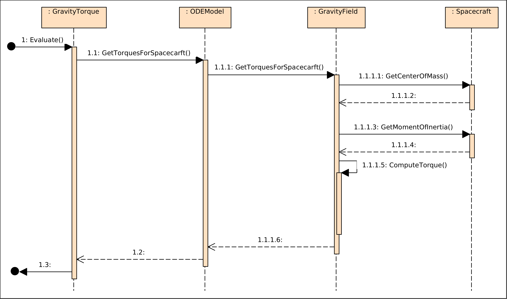
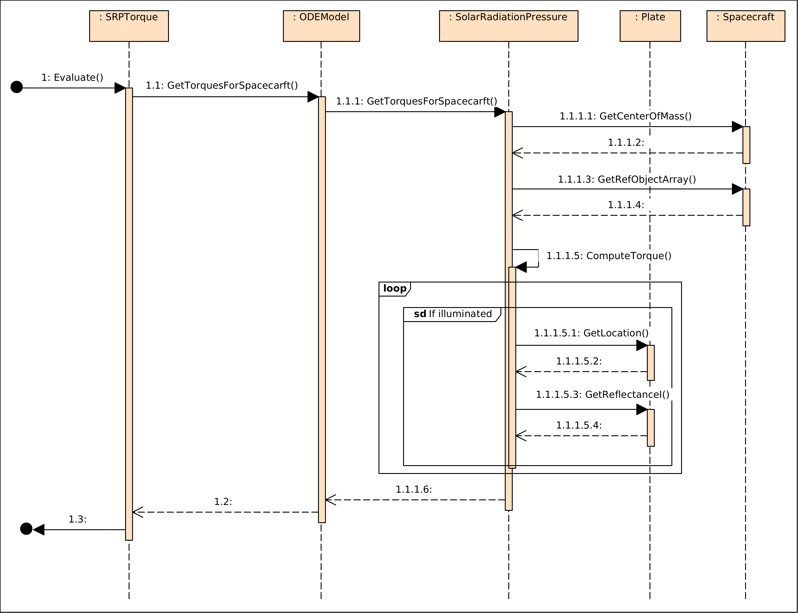
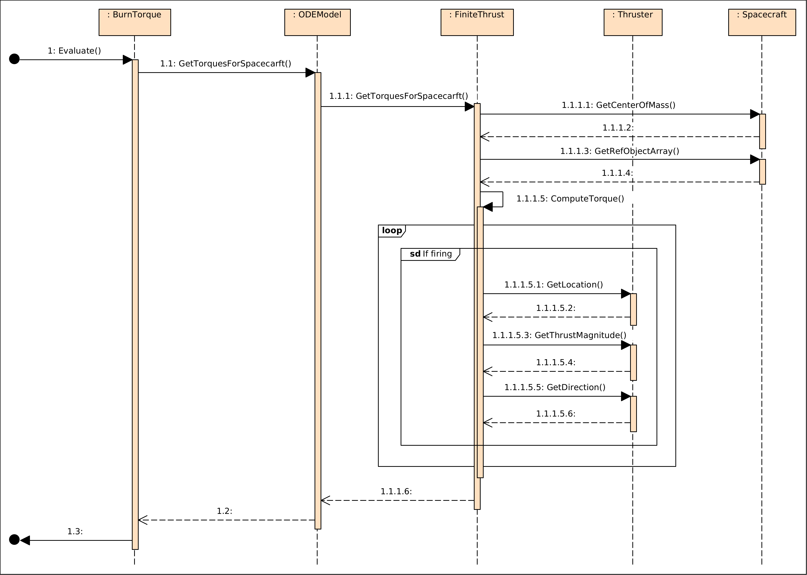
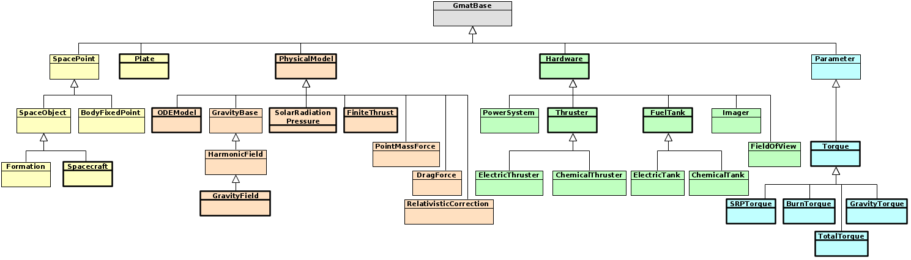

.. _TorqueModeling:

***************
Torque Modeling
***************
Torque computations are turned on in GMAT script as a parameter on the force model component.  When a GMAT script turns on torque modeling for a force model using the "ComputeTorques" field, the data structures and references needed for computation of torques are added to the force model objects.  

Note that in GMAT, torques are not included in the propagation modeling.  Torque computations are available for reporting only.  TBD: How to reflect this in docs for momentum calculations.

A prerequisite for the torque model components listed here is the extended set of features required for modeling the spacecraft center of mass, moments of inertia, and (optionally) center of gravity, described in M. Stark, "Math Background For Mass Property Calculations."

**TBD: Should this document include a design specification for the mass properties to accompany the math spec?**

Scripting
=========
:numref:`TorqueScripting` shows scripting for torque reporting in GMAT.  

.. _TorqueScripting:
.. code-block:: matlab
   :caption: Sample scripting for torque modeling
   :linenos:

   Create Spacecraft GOESR
   ...
   GMAT GOESR.AddPlates  = {Plate1, ...}
   ...

   Create Plate Plate1;
   ...

   ...
   GOESR.Thrusters = {AJ13, AJ14, AJ15, AJ16, LTR17, LTR18, LTR19, LTR20, LTR21, LTR22, ...
                      LTR23, LTR24, LTR25, LTR25, LTR27, LTR28, LTR29, LTR30, LTR31, LTR32}
   ...

   Create ChemicalThruster LTR17;
   GMAT LTR17.HWOriginInBCSX = -1.0;   % BCS location in meters (TBD is this what GMAT uses?)
   GMAT LTR17.HWOriginInBCSY =  0.0;
   GMAT LTR17.HWOriginInBCSZ =  1.4;
   GMAT LTR17.DirectionX =  0.0;
   GMAT LTR17.DirectionY = -1.0;       % BCS -Y direction
   GMAT LTR17.DirectionZ =  0.0;
   ...

   Create ForceModel fm;
   GMAT fm.CentralBody = Earth;
   GMAT fm.PrimaryBodies = {Earth};
   GMAT fm.Drag = None;
   GMAT fm.SRP = On;
   GMAT fm.SRP.SRPModel = NPlate
   GMAT fm.ComputeTorques = On;
   ...
   Create Propagator prop
   GMAT prop.FM = fm
   ...

   Create FiniteBurn burn1
   burn1.Thrusters = {LTR17, LTR21}

   Create ReportFile Torques;
   ...

   Create ReportFile BurnTorques;
   ...

   Create Variable elapsed remaining step duration;

   BeginMissionSequence;

   While GOESR.ElapsedDays < 1.0
      Propagate prop(GOESR) {GOESR.ElapsedSecs = 600.0};
      Report Torques GOESR.UTCGregorian GOESR.fm.CenterOfMass GOESR.fm.TotalTorque GOESR.fm.SRPTorque;
   EndWhile

   BeginFiniteBurn burn1(GOESR);
   elapsed = 0.0;
   step = 300.0;           % report every 5 minutes
   duration = 1680.0;      % 28 minute burn

   Report BurnTorques GOESR.UTCGregorian GOESR.fm.CenterOfMass GOESR.fm.BurnTorque GOESR.AJ13.Torque ...
                      GOESR.LTR17.Torque GOESR.LTR21.Torque;
   
   While GOESR.ElapsedSecs < duration

      remaining = duration - elapsed

      If remaining > step
         Propagate prop(GOESR) {GOESR.ElapsedSecs = step}
      Else
         Propagate prop(GOESR) {GOESR.ElapsedSecs = remaining}
      EndIf

      Report BurnTorques GOESR.UTCGregorian GOESR.fm.CenterOfMass GOESR.fm.BurnTorque GOESR.AJ13.Torque ...
                      GOESR.LTR17.Torque GOESR.LTR21.Torque;

      elapsed = elapsed + step;

   EndWhile

This scripting is provided to present a relatively complete listing of the script elements necessary for the torque calculations.  Lines 1 - 7 show the spacecraft configuration used to model the spacecraft for solar radiation pressure torque calculations.  The user constructs the spacecraft geometry in a GMAT script as a collection of flat plates.  

Sample Output
=============

.. _EnvironmentTorqueOutput:
.. code-block:: matlab
   :caption: Sample maneuver free torque data output (precision truncated for this doc)
   :linenos:

   GOESR.UTCGregorian GOESR.fm.CenterOfMass GOESR.fm.TotalTorque GOESR.fm.SRPTorque
   14 Apr 2022 09:50:00.000 [-0.047644 0.339383 2.025402] [0.000811 0.000445 0.000001] [0.000811 0.000445 0.000001]
   14 Apr 2022 10:00:00.000 [-0.047644 0.339383 2.025402] [0.000811 0.000444 0.000001] [0.000811 0.000444 0.000001]
   14 Apr 2022 10:10:00.000 [-0.047644 0.339383 2.025402] [0.000812 0.000445 0.000001] [0.000812 0.000445 0.000001]
   14 Apr 2022 10:20:00.000 [-0.047644 0.339383 2.025402] [0.000812 0.000444 0.000001] [0.000812 0.000444 0.000001]
   ...

Note that with the current release, the total torque and the SRP torque are identical when no maneuver is being performed, because in this first release the only environmental torque available is the SRP torque.

.. _ManeuverTorqueOutput:
.. code-block:: matlab
   :caption: Sample maneuver torque data output (See text for variable explanation)
   :linenos:

   GOESR.UTCGregorian GOESR.fm.CenterOfMass GOESR.fm.BurnTorque GOESR.AJ13.Torque GOESR.LTR17.Torque GOESR.LTR21.Torque
   15 Apr 2022 09:50:00.000 [CMX CMY CMZ] [BX BY BZ] [0 0 0] [T17X T17Y T17Z] [T21X T21Y T21Z]
   ...
   15 Apr 2022 10:15:00.000 [CMX CMY CMZ] [BX BY BZ] [0 0 0] [T17X T17Y T17Z] [T21X T21Y T21Z]
   15 Apr 2022 10:18:00.000 [CMX CMY CMZ] [BX BY BZ] [0 0 0] [T17X T17Y T17Z] [T21X T21Y T21Z]

Rather than provide explicit data in :numref:`ManeuverTorqueOutput`, the data shown there has the following features::

   #     is a placeholder for the component: X, Y, or Z
   CM#   is the center of mass of the spacecraft, evolving through the maneuver
   B#    is the total torque vector, in the BCS frame, from the burn at the specified epoch
   T17#  is the BCS torque vector from the LTR17 thruster
   T21#  is the BCS torque vector from the LTR21 thruster

With this convention, 

.. math::
   :nowrap:
   :label: ThrusterMath

   \begin{eqnarray*}
      BX &= T17X + T21X \\
      BY &= T17Y + T21Y \\
      BZ &= T17Z + T21Z
   \end{eqnarray*}

Note that the third array shown in the output is all zeroes.  The thruster AJ13 was not active during the finite burn, so the torque applied from that thruster is zero.

.. note::
   The sample output presented here is a draft of the output report.

   *This note will be removed when the output format is finalized.*

Torque Modeling Software Components
===================================
Torque computation is built on top of the standard GMAT initialization and execution processes performed when a script is run.  The general procedure is that scripted objects are cloned into the GMAT Sandbox and connected together for the run.  Inside the Sandbox, each object is initialized to ensure that it is ready for use, and that all necessary connections are in place.  During this process, Spacecraft objects are passed scripted components prior to initialization.  Those components are copied by the spacecraft for use in the simulation, and then initialized as part of the spacecraft initialization process.  

The pieces that play a roll in the torque modeling in a run are the tank and thruster components of the spacecraft and the plates used while computing solar radiation pressure modeling.  Future builds of GMAT may use the plate model for drag modeling as well, but the current release does not yet incorporate that piece of the modeling.  

The tank components are used in the center of mass and moment of inertial computations that feed into the torque modeling.  In the absence of maneuvers, these mass properties are treated as fixed in the spacecraft body coordinate system.  During maneuvers, fuel (consisting of propellant and oxidizer) and pressurant are modeled as moving through the propulsion system, changing the mass properties of their respective tanks and thus of the composite spacecraft system.

In GMAT, the torque modeling is all computed about the center of mass of the spacecraft.  The moment of inertial computation is used directly in the gravity gradient torque modeling.  The plates attached to the spacecraft are used in the spacecraft model of the solar radiation pressure when that model is set for NPlate modeling.  (If the SRP model is set to perform spherical modeling, the resulting torque is 0.0.)  Thrusters, when firing, apply a force at a set location on the the spacecraft, and thus play an active role in torque modeling.

Computing Center of Mass and Moment of Inertia
----------------------------------------------
TBD - is Mike spec'ing this?

Torque Computation
------------------
GMAT's dynamics system provides the backbone for modeling the forces and other derivatives used in propagation and estimation.  The system does not provide modeling capabilities for attitude dynamics, but it does provide the mechanism used to calculate the instantaneous torques acting on a spacecraft for reporting purposes.  This capability is implemented in the dynamics modeling subsystem and made available to users through calculated parameters.  Torques can be computed and reported at several levels of complexity:

* The torque applied to specific components, relative to a Spacecraft's center of mass, can be reported for the following models:

   * Torques from Solar Radiation Pressure applied to the plates used to model a spacecraft's geometry
   * Torques due to the mass distribution of a spacecraft, as represented by the spacecraft's moment of inertia tensor, in the gravitational field of a central body
   * Torques applied by thrusters during maneuvers

* The torque applied to a spacecraft in free flight without maneuvers
* The total torque acting on the spacecraft due to all of the modeled torques

.. note::   The models implemented in the current torque modeling design may be extended in the future to account for the following torque sources:

   * Aerodynamic (e.g., atmospheric drag) torques applied to the plates used to model a spacecraft's geometry
   * Solar radiation pressure and aerodynamics applied to a Solar Pressure and Aerodynamic Drag (SPAD) based representation of the spacecraft's geometry
   * Torques applied by external magnetic fields
   * Torques applied by reaction wheels on the spacecraft
   * Torque contributions from the central body's oblateness 
   * Torques from multiple gravitating bodies
   * Torques arising from reflected radiation
   * Torques arising from outgassing of components of the spacecraft

   These torque sources are not modeled in the current design, but can be added through direct extension of the design by making appropriate changes to the corresponding dynamics models where applicable, and by extending GMAT's dynamics modeling suite for contributions that are not modeled.

The general process for computing each type of torque is the same in GMAT.  The mission control sequence triggers reporting of a torque acting on a spacecraft through a script line like

.. code-block:: matlab

   Report Torques GOESR.fm.GravityTorque;

This scripting tells GMAT to call the Evaluate() method on the GravityTorque calculated parameter.  During initialization, the parameter is configured to use a specific spacecraft - GOESR in this example - and a specific ODEModel - the ForceModel fm.  The Evaluate() method calls the force model's GetTorqueForSpacecraft() method, identifying the torque type requested as the gravity gradient based torque.  The ODEModel locates the gravity model in its list of forces, and calls the GetTorqueForSpacecraft() method on that force, identifying the spacecraft object that experiences the torque.  The force calls the spacecraft for data needed for the torque calculation, performs the computation of the torque about the spacecraft's center of mass, and returns that vector to the ODE model.  The ODE model returns the torque to the parameter, which then reports the data to the Report command.

General Considerations
----------------------
GMAT reports torques about the spacecraft center of mass, so each constituent is computed relative to that location, rather than to the spacecraft's body coordinate system (BCS) origin.  Calculations that use :eq:`rcrossF` for torque calculations use the location of the center of mass as the origin for the moment arm, and the vector  

.. math::
   :label: torqueOrigin

   \textbf{r}_{\tau} = \textbf{r}_{F} - \textbf{r}_{cm}

where

   :math:`\mathbf{r}_{\tau}` is the moment arm for the torque

   :math:`\textbf{r}_{F}` is the location at which the torquing force is applied

   :math:`\textbf{r}_{cm}` is the location of the center of mass of the spacecraft

Gravity Gradient Torques
------------------------
The torque due to gravity pulling on the distributed elements of the spacecraft induces a torque due to the mass distribution of those elements.  Evaluation of this torque type follows the process described generically above, as shown in :numref:`GGTorque`.

.. _GGTorque:

   Gravity Gradient Torque Computation

The gravity gradient torque is computed from the interaction of the gravity field with the spacecraft's moment of inertial relative to the center of mass using the equation [Markley]_

.. math::
   :label: GGEquation

   \boldsymbol{\tau}_{gg} = {{3 \mu}\over{r^3}} \textbf{n} \times \textbf{I}_c \textbf{n}

where

   :math:`\mu`  is the gravity constant for the gravitating body

   :math:`r`    is the distance from the body to the spacecraft

   :math:`\textbf{n}`  is the nadir pointing vector

   :math:`\textbf{I}_c`  is the moment of inertia tensor about the spacecraft's center of mass  

.. [Markley] \L. Markley and J. Crassidis, **Fundamentals of Spacecraft Attitude Determination and Control**, Springer, 2014.

SRP Torque
----------
GMAT lets the user configure radiation pressure modeling for a spacecraft using one of 3 models: as a spherically symmetric, reflecting "cannonball," using a shape model defined in a Solar Pressure and Aerodynamic Drag (SPAD) file, or using a set of plates that define the spacecraft surfaces that interact with the solar radiation.  

The symmetry of the cannonball model balances out the forces acting across spacecraft's area, so there is no net torque applied when using that model.  The SPAD configuration is built on a ray-traced representation of the spacecraft, making modeling of the contribution from each element of the spacecraft model complicated to compute.  Torques using that model are not implemented in this iteration of the torque model design.  

The plate model [Nguyen]_\ , on the other hand, is incorporated in this work, and documented here.  SRP torques are computed when the SRPTorque parameter is evaluated, using calls like 

.. code-block:: matlab

   Report Torques GOESR.fm.SRPTorque;

The process flow for SRP torque modeling, shown in :numref:`SRPTorques`, is similar to that followed for gravity gradient torques.  

.. _SRPTorques:

   Torque Computation for Plate-based Solar Radiation Pressure

The computation starts with a call to the Evaluate() method on the SRPTorque parameter associated with a spacecraft (e.g., GOESR) and ForceModel (e.g., fm).  The Evaluate() method calls the force model's GetTorquesForSpacecraft() method, passing in the spacecraft and type of torque requested.  The force model locates the force member associated with the torque type, and calls its GetTorquesForSpacecraft() method.  The force member calls the Spacecraft's GetCenterOfMass() method, retrieving the location of the center of mass in the body coordinate system.  The process to this point matches that followed for computing gravity gradient torques. 

Once the center of mass has been accessed, the force member calls the spacecraft's GetRefObjectArray() method and retrieves the array of plates attached to the spacecraft.  That array is used in the ComputeTorque() method to accumulate the total SRP torque acting on the spacecraft.  The accumulated torque from *n* plates is given by

.. math::
   :label: TotalSRPEquation

   \boldsymbol{\tau}_{SRP} = \sum_{i=1}^{n} \boldsymbol{\tau}_i^{SRP}

where :math:`\boldsymbol{\tau}_i^{SRP}` is the torque applied on the *i*\ th plate by the incident solar radiation.  

Setting the unit vector to the Sun to be

.. math::

   \textbf{s} = {{\textbf{R}_{\odot}} \over {R_{\odot}}},

where

   :math:`\textbf{R}_{\odot}`  is the vector from the Sun to the spacecraft

   :math:`R_{\odot}`  is the magnitude of :math:`\textbf{R}_{\odot}`

the torque for the *i*\ th plate is given by [Vallado]_

.. math::
   :label: PlateTorque

   \boldsymbol{\tau}_i^{SRP} = \textbf{r}_i \times \left[{{\Phi}\over{c}} A_i \textbf{n} \cdot \textbf{s} \left({{R_{AU}} \over {R_{\odot}}}\right)^2 \right] \textbf{T} 

where

   :math:`\textbf{r}_i`  is the vector from the spacecraft center of mass to the location the force applies

   :math:`\Phi`  is the mean solar flux 

   :math:`A_i`  is the area if the *i*\ th plate

   :math:`R_{AU}`  is scale distance for the solar flux measurement, 1 astronomical unit (A.U.)

   :math:`\textbf{n}`  is a unit normal vector pointing out from the plate

   :math:`\textbf{T}`  is the weighted force direction vector, defined below

The force direction vector. :math:`\textbf{T}`, accounts for the reflected, absorbed, and transmitted portions of the incident solar radiation on the plate applying the torque.  The reflected light can be be further broken into specular and diffuse reflection, each with its own coefficient of reflectivity.  The weighted force direction vector is set using

.. math::
   :label: ReflectanceVector

   \textbf{T} = -2 C_{Rs} \left(\textbf{n} \cdot \textbf{s}\right) \textbf{n} - C_{Rd} \left( {{2}\over{3}} \textbf{n} + \textbf{s} \right) - C_a \textbf{s}

where

   :math:`C_{Rs}`  is the coefficient of specular reflection

   :math:`C_{Rd}`  is the coefficient of diffuse reflection

   :math:`C_{a}`  is the coefficient of absorption

Note that the GMAT plate model specified in [Nguyen]_ manages the details of the reflection model presented here, and should be used in coding the new features of the system.  

Finally, plates that are oriented such that the plate normal vector points away from the sun should be omitted when accumulating the total SRP torque.  In other words, if

.. math::

   \textbf{n} \cdot \textbf{s} > 0

the plate contributrion should be ommited when calculating :eq:`TotalSRPEquation`\ .

**TO DO:** Check the signs in :eq:`ReflectanceVector` since :math:`\textbf{s}` points from the Sun to the spacecraft.

.. [Nguyen] \T. Nguyen, *SRP n Plates Math Spec*, 2019.

.. [Vallado] \D. Vallado, **Fundamentals of Astrodynamics and Applications**, 4th Ed., Microcosm Press, 2013.

Thruster Torques
----------------
GMAT's finite burn model simulates the interactions of tanks and thrusters to perform spacecraft maneuvers for orbital control.  The low thrust extensions to this model add the ability to model electric propulsion systems through the incorporation of power system modeling.  Torques from thrusters are modeled similarly to the other torque models defined in this document, with the following additional considerations:

* The mass properties of the power system and thruster hardware, and for empty fuel tanks, are part of the spacecraft dry mass properties.
* Fuel mass and mass distribution is modeled as part of the tank mass properties, documented separately.
* Thruster torques are zero for inactive thrusters.
* Thruster torques accumulate similarly to plate torques, and produce the total thruster torque to the user upon request.

Thruster torques are computed when the SRPTorque parameter is evaluated, using calls like 

.. code-block:: matlab

   Report Torques GOESR.fm.BurnTorque;

The process flow for thrust torque modeling, shown in :numref:`BurnTorques`, is similar to that followed for solar radiation pressure torques.  

.. _BurnTorques:

   Torque Computation for Finite Burns
 
The computation starts with a call to the Evaluate() method on the BurnTorque parameter associated with a spacecraft (e.g., GOESR) and ForceModel (e.g., fm). The Evaluate() method calls the force model’s GetTorquesForSpacecraft() method, passing in the spacecraft and type of torque requested. The force model locates the force member associated with the torque type - a FiniteThrust force in this case - and calls its GetTorquesForSpacecraft() method. The force member calls the Spacecraft’s GetCenterOfMass() method, retrieving the location of the center of mass in the body coordinate system. The process to this point matches that followed for computing the other torque types.  

Next the FiniteThrust force calls the Spacecraft's GetRefObjectArray() method, retrieving pointers to the thrusters attached to the spacecraft.  When GMAT activates a finite burn, the code sets a flag on each thruster included in the burn indicating that the thruster is firing.  Using this flag, the force loops through the thruster list, accumulating the total torque from the thrust, :math:`\boldsymbol{\tau}_{thrust}`\ , by adding together the thrust torques for the n active thrusters

.. math::
   :label: TotalThrustTorque

   \boldsymbol{\tau}_{thrust} = \sum_{i=1}^{n} \boldsymbol{\tau}_i^{thrust}

where :math:`\boldsymbol{\tau}_i^{thrust}` is the torque applied on the spacecraft by thruster :math:`i`\ .

Each active thruster supplies three pieces of data for its torque computation: the location of the thruster in BCS coordinates, :math:`\textbf{r}_i^{thruster}`\ , the magnitude of the thrust in Newtons, :math:`t_i`\ , and the direction of the thrust, :math:`\hat{\textbf{a}}_i`\ .  The result is the torque from the thrust supplied by that thruster,

.. math::
   :label: singleThrusterTorque

   \boldsymbol{\tau}_i^{thrust} = \textbf{r}_i \times t_i \hat{\textbf{a}}_i

where :math:`\textbf{r}_i` is defined as before:

.. math::
   :label: thrustMomentArm

   \textbf{r}_i = \textbf{r}_i^{thruster} - \textbf{r}_{cm}

using the usual definitions:

   :math:`\textbf{r}_i` is the moment arm for the torque

   :math:`\textbf{r}_i^{thruster}` is the location at which the *i*\ th thruster's force is applied

   :math:`\textbf{r}_{cm}` is the location of the center of mass of the spacecraft

.. note:: Torque reporting for individual thrusters is not implemented at this time.

Total Torque
------------
GMAT reports the total torque acting on the spacecraft by adding together each individual torque source.  This reporting is scripted using the syntax

.. code-block:: matlab

   Report Torques GOESR.fm.TotalTorque

The TotalTorque parameter instructs the associated force model to walk through its vector of force contributors, calling GetTorqueForSpacecraft() on each force and adding them together:

.. math::
   :label: totalTorque

   \boldsymbol{\tau}_T = \sum_{i=1}^{n} \boldsymbol{\tau}_i

where

   :math:`\boldsymbol{\tau}_T` is the total torque modeled in the ODEModel

   :math:`\boldsymbol{\tau}_i` is the torque from the *i*\ th force

Note that forces that do not compute torques return a zeroed torque vector.  The reported total torque is the total **modeled** torque.  Users need to be aware that the modeling may miss contributions from forces included in the orbit modeling but not supported in torque modeling. 

Software Components
===================
:numref:`TorqueClasses` shows the GMAT class branches that participate in torque computations in the system, along with some peer classes to show context in the GMAT architecture.  The classes shown with thicker borders are updated for torque modeling in the first release of this feature.  The sections below provide an overview of the changes needed to provide the torque modeling features for each affected class.

.. _TorqueClasses:

   The classes used for torque calculations

The Spacecraft
--------------
Torque modeling requires information about the geometry of the spacecraft configuration in order to compute the spacecraft center of mass and the moment arms used for torque calculations, along with the moment of inertia tensor needed for the gravity gradient calculation.  The GMAT simulation is built around the Spacecraft object.  That component defines the spacecraft configuration, and is the container for tanks, thrusters, the surfaces used for drag and solar radiation pressure modeling (e.g., the plates defining the spacecraft geometry), and other components used in the simulation.  The core spacecraft includes a field defining the spacecraft dry mass, ballistic properties not covered elsewhere, state information, and attitude definitions.  

The core Spacecraft model supports torque modeling through the addition of fields used to model the center of mass and moments of inertia of the spacecraft, as specified elsewhere [Stark]_\ .

.. [Stark] \M. Stark, *Math Background For Mass Property Calculations*, 2021.

Hardware
--------
The GMAT Hardware base class provides fields for configuration of the locations and orientation of components in a spacecraft body coordinate system.  These fields are largely unused in releases of GMAT prior to the R2020a release, and hidden from the user scripting.  Classes derived from the Hardware base class should enable the fields as needed to support the mass properties and torque modeling features of the system.

Tank Models
-----------
GMAT support both chemical and electric propulsion system tanks, derived from a base FuelTank class.  For the purposes of the torque computations, the distribution of the fuel in each tank must be tracked in order to compute the location of the spacecraft center of mass, and to compute the moment of inertia tensor.  The details of the propulsion system type does not affect the mass distribution in the GMAT code.  Accordingly, the code tracking the mass distribution in each tank is incorporated into the FuelTank class.

The detailed mathematical specification for the fuel mass distribution is documented separately [FuelMassSpec]_\ .

.. [FuelMassSpec] Documentation TBD.  Best guess is that the implementation will be via a helper class interface and an initial implementation for GOES implemented as a derived class, once the GOES model is understood.

Thruster Models
---------------
GMAT support both chemical and electric propulsion system thrusters, derived from a base Thruster class.  The thrust magnitude and direction are built into this class.  Since it is derived from the Hardware class, it inherits the location information from that class.  That location is used in the moment arm calculation for the thrust torques (\ :eq:`thrustMomentArm`\ ).  The thrust vector is computed in a FiniteThrust force object, so the torque for a thruster is built there.

Plate
-----
The current implementation of the plate model in GMAT was added to the system to include the plate-by-plate radiation pressure contributions to the forces modeling the orbital dynamics, allowing a better model of the trajectory and the ability to estimate properties of the plates during orbit determination.  While this implementation accounts for the pressure applied to each plate in the spacecraft model, it does not account for the torques applied to the vehicle because the model is missing location data for the plates.

Implementation of plate based solar radiation pressure torques requires that the force center for each plate be added to the plate model so that :eq:`PlateTorque` can be computed for each plate.  This can be accomplished either by adding a location field to the Plate class, along with the matching script access methods, or by revising the inheritance structure of the Plate class so that it is derived from the Hardware class rather than directly from GmatBase.

PhysicalModel
-------------
The environmental torque models, and to a lesser extend the thrust torque model, depends on the underlying force computations performed in GMAT's force model classes.  Each modeled dynamics system in GMAT is derived from the PhysicalModel base class.  That class defines the interfaces into dynamics modeling used in propagation, simulation, estimation, and Jacobian and state transition matrix computations.  The parameters used to report the forces acting on a spacecraft are implemented in the PhysicalModel classes through its GetDerivativesForSpacecraft() method.  Torque modeling follows a similar pattern in the code through the addition of a GetTorquesForSpacecraft() method.  

The new method has the signature

.. code-block:: matlab

   virtual Rvector3 GetTorquesForSpacecraft(Spacecraft *sat, const std::string &type = "TotalTorque");

The first argument is the spacecraft; the second the torque type.  Forces not implementing the method return a zero vector for the torque.  Types that may return a non-zero torque are aligned with the scripting shown above: "GravityTorque," "SRPTorque," "BurnTorque," and "TotalTorque."  As new torque models are added to the system, this list will grow.  In the code, the GetTorquesForSpacecraft() method may be overridden with an enumeration and matching signature that replaces the second argument with an unsigned integer.

The derived classes from the PhysicalModel base class implement the torque model calculation in overridden implementations of GetTorquesForSpacecraft() as follows.

ODEModel
--------
GetTorquesForSpacecraft() in the ODEModel class calls the GetTorquesForSpacecraft() method on its dynamics models and accumulates the torques returned from each model.  The "type" input parameter is used to select the member dynamics models that are called for that accumulation; when the type us set to "TotalTorque", the return values from all of the models managed by the ODE model are added together using :eq:`totalTorque`\ .  Other settings for the Type field produce the accumulation of the torques from the corresponding dynamics model types - e.g., "SRPTorque" accumulates torques from any member SRP dynamics models in the ODEModel.

The SRP Model
-------------
GetTorquesForSpacecraft() in the SolarRadiationPressure class implements :eq:`TotalSRPEquation` by computing, plate by plate, the torque acting on the plate due to incident solar radiation.

The GravityField Model
----------------------
GetTorquesForSpacecraft() in the GravityField class implements :eq:`GGEquation` using the moment of inertia tensor retrieved from the spacecraft.

FiniteThrust
------------
GetTorquesForSpacecraft() in the FiniteThrust class implements :eq:`TotalThrustTorque` for the active thrusters on the spacecraft.

Torque Parameters
---------------------------------
Beginning with GMAT R2014a, the system has supplied calculation parameters in a GMAT plugin module that support reporting for mass flow, atmospheric density, and thrust data.  The NewParameter plugin is extended in this work to add the reporting parameters for torque modeling.  The Torque base class sets up the data providers and interface code used by these parameters.  The derived GravityTorque, SRPTorque, BurnTorque, and TotalTorque classes provide the scripting interfaces for the corresponding code as described above.  Implementation mirrors the code in the NewParameter plugin.
